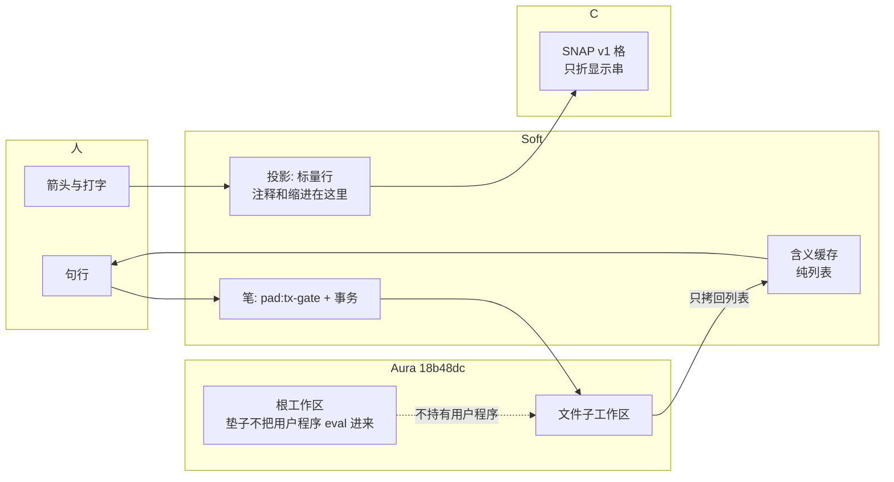
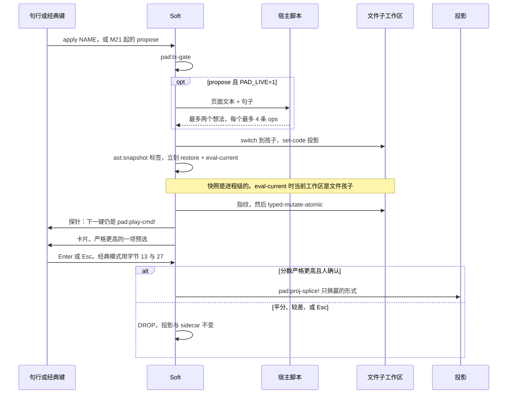

# 下一版 Aura Pad：人用的是活工作区，不是编辑器戏服

| | |
|---|---|
| 作者 | aura-pad design |
| 日期 | 2026-10-07 |
| 状态 | Draft（评审修订） |
| 仓库 | `cybrid-systems/aura-pad`（`/home/dev/code/grok-dev/aura-pad`） |
| 引擎 | Aura **`18b48dc`**（`docs/ISSUES.md`；不要升到 `e7b236d` / `0ba8690` / `02f03f3`） |
| 取代 | 不改写 `docs/DESIGN.md`。本文是 M0–M17 之后的产品设计 |
| 读者 | 熟悉 `docs/DESIGN.md` 与 `docs/aura-vs-rust.md` 的人 |

---

## Overview

今天的 `aura-pad` 能画一页字，也能在冒烟里调用 Aura 独有的工作区。这两件事不在同一次运行里。人打开文件时走的是 `soft/pad/play.aura`：vi normal、Emacs `M-x`、`ctrl-x` 和弦、空格补全命令词。`set-code`、`typed-mutate-atomic`、子工作区、指纹、`intend` 都在冒烟文件里，`play.aura` 不加载它们。`docs/tutorial.md` 教的是戏服上的操作，不是活程序。这个产品因此被拒绝。

下一版把**同一次 `aura-pad FILE` 运行**变成三件事、一台机器。人打开真实的 Aura 源文件，引擎回答名字在哪里出生、在哪里被用、改完哪些节点脏了、谁写的这个 define，页面上的排版和注释仍留在编辑器投影里，因为 `query:code` 会丢掉它们。人用一句话请 AI 改代码，这次改动是子工作区里的一次硬类型门事务：整笔成功或整笔不存在，和当前页在同一目标上比分，严格更高才 KEEP，DROP 不留痕迹，落笔前先盖指纹，一次 undo 把源码和作者一起收回。孩子在故事投影上走同一条循环，句子不超过 8 个词，不学 `M-x`。

产品的默认表面是句行，不是键位表。`PAD_CLASSIC=1` 才回到今天的 vi / Emacs。这个默认**不是第一笔提交就翻掉的**。`aura-pad` 在 PR 第 21 步之前仍由 `vi_flag()` 默认 `PAD_VI=1`，现有 `PAD_CLI_OK` 保持绿色。第 21 步才同时改两个环境注入点和 pty 场景，人从此可以打开、改、保存、退出并检查一个真实文件。指纹与 AI 在这一步之后。

---

## Background & Motivation

### 运行中的进程实际加载了什么

`soft/pad/play.aura` 第 20–41 行加载 `buffer.aura`、`lines.aura`、`edit.aura`、`hl.aura`、`jump.aura`、`view.aura`、`lc.aura`、`keys.aura`、`card.aura`、`who.aura`、`play_in.aura`、`wire2.aura`、`file.aura`、`vi.aura`、`screen.aura`、`emacs.aura`、`win.aura`。它**不**加载 `std.aura`、`ws.aura`、`pen.aura`、`robot.aura`、`world.aura`、`book.aura`、`aura_pad.aura`、`ai.aura`、`fix_loop.aura`、`layout.aura`、`preview.aura`、`story.aura`。后三个在第一次对应的 `M-x` 词上才加载（`win.aura` 里 `pad:wn-layout!` / `pad:wn-preview!` / `pad:wn-story!`）。工作区栈按 `docs/m9.md`、`docs/m11.md`、`docs/m12.md`、`docs/m13.md` 的写法，故意不进按键路径。结果是：`PAD_M9_OK` … `PAD_M13_OK` 都绿，人在终端里仍然打不开引擎。

这 17 个已加载文件的顶层 `(define ` 合计 **741** 个（`vi.aura` 单独 147 个）。#4350 按的是定义已经驻留之后的每一次 Soft 调用，不是按 `set-code` 的次数。检查之后 `std` 与 `ws` 也驻留，方向键变贵是这个原因。只断言 `set_code` 不增加，并不等于「页面不卡」。

`c/aura_pad.c` 的 `vi_flag()`（第 260–264 行）在没有 `PAD_VI` 时返回 `"1"`。`child_env`（第 273 行）`setenv("PAD_VI", …)`。docker 回退的 `build_argv`（第 319 行）另写 `-e PAD_VI=%s`，**不**读 `child_env`。第 361 行只在 `!docker_mode` 时调用 `child_env`。两处今天都不设置 `AURA_MUTATE_TYPE_GATE`。`pad:vi-boot!`（`vi.aura` 第 164–167 行）只在 `PAD_VI=1` 时把模式设成 `normal`。

`scripts/smoke.sh` 第 157 行调用 `scripts/smoke_cli.sh`。`scripts/cli_pty.py` 第 105–120 行要求启动帧里有 `[normal]`，并在打字前送字节 105（`i`）。`PAD_SMOKE_OK` 因此包含 `PAD_CLI_OK`。直接 `exec play.aura` 的那些冒烟不经过这个二进制。

`README.md` 把启动描述成 vi normal：`i` 才打字，`M-x` 里空格调用 `pad:em-complete-space!`。`ctrl-s` 在文件模式里被 `file.aura` 拿去提示「怎么保存」，笔记本检查 `pad:nb-line!`（`ws.aura`）没有接到这个循环上。`docs/tutorial.md` 自己写了：现在的画面没有把检查接到按键上。

### 真实文件被只读拒绝

`file.aura` 第 42–43 行：`*pf-max-col*` = 400，`*pf-max-lines*` = 500。`pad:pf-open!` 把宽度、行数、或字节不在 32–126 的文件标成 `*pf-ro*`，行被截断，非 ASCII 变成 `?`（63），`pad:pf-save!` 对 `*pf-ro*` 直接返回 `"ro"`，不写盘。

2026-10-07 对 `/home/dev/code/grok-dev/aura-grok/lib` 的 83 个 `.aura` 文件实测：

| 事实 | 数量 |
|---|---|
| 含 UTF-8（注释里的 `—` `→` `←` `·` 等） | **83 / 83** |
| 含 Tab | 0 |
| 超过 500 行 | 2：`std/swarm.aura` 857 行，`std/agent.aura` 630 行 |
| 超过 400 列 | 1：`std/adaptive.aura` 最宽行 **2084** |
| 顶层形式 | `socket.aura` = 8 个 `define` + 1 个 `export`；`string.aura` = 28 个 `define` + 1 个 `export`；`llm.aura` 另有 1 个 `require`；`swarm.aura` 另有 2 个 `require` |

因此今天 `aura-pad lib/std/socket.aura` 打开的是只读、问号替换过的残页，并且永远不会写回。这不是 12×40 的儿童页能解释的。`screen.aura` 已经能按光标切片（窗口列上限 `pad:vw-cap` 到 400），缓冲本身却被 `*play-max-col*` 卡死。`lines.aura` 的 `*max-col*` 默认 12，文件打开时被设成 400。

顶层头不是 `define` / `export` 的库文件不止 `llm.aura` 与 `swarm.aura`（还有 `if`、`defmacro` 等）。一次粗扫与另一次数过的个数不一致。**合同不锁定 33 或 35。** issue 11 打印当次个数。`socket.aura` 的 define 是原语别名 `(define tcp-connect tcp-connect)`，引用次数 0 是合法的 `SAY`，不是失败。

### 引擎能力在冒烟里，不在手上

`docs/aura-vs-rust.md` 把只有 Aura 能拼起来的东西排了序。M11 按这个顺序做完了，标记是 `PAD_M11_UNDO_OK` … `PAD_M11_FIX_OK`，但入口不在 `play.aura`。人对它的全部接触是：

- `M-x ask` / `chat` / `rewrite`（`ai.aura`）。`pad:ai-rewrite!` 把模型文本交给 `pad:ai-set-text!`，直接换掉页面。`u` 只是文本撤销。没有 `typed-mutate-atomic`，没有子工作区，没有指纹。
- `M-x preview`（`preview.aura`）在旁边开一页**文本**，词表门卫之后比一个目标字符串。这不是活 AST。
- `M-x layout` / `story:*` 赛的是窗口树，不是程序。

`propose_minimax.py` 的热槽提议（M2–M4）同样只在冒烟和 `PAD_LIVE` 里。

### 已经关闭、不要再做一遍的窗口工作

`gh` 不在本机（`command not found`）。GitHub MCP `list_issues`：`state=OPEN` 的 `totalCount` 是 **0**；`state=CLOSED` 恰好 4 条，都是 2026-10-07 的窗口里程碑：

| 编号 | 标题 | 状态 |
|---|---|---|
| #3 | `[M14] Soft-owned dynamic windows: Emacs window tree on one frame` | CLOSED |
| #2 | `[M15] Layout worldlines: race window configurations, KEEP the best` | CLOSED |
| #1 | `[M16] Magic preview windows for proposals` | CLOSED |
| #4 | `[M17] Living storybook windows: grow, celebrate, auto-split on progress` | CLOSED |

代码已在 `win.aura`、`layout.aura`、`preview.aura`、`story.aura`。本文不新开窗口里程碑，不新加 `M-x` 动词，不重做分屏、layout 赛跑、preview 侧页、story grow/cheer。已有的窗口树只许被事务卡片**当作已经存在的矩形**来用。

### 必须遵守的实测成本

来自 `docs/aura-vs-rust.md`、`docs/ISSUES.md`、`docs/ROADMAP.md`，二进制钉在 `18b48dc`：

| 动作 | 成本 | 允许出现的地方 |
|---|---|---|
| 12 行页插入 | ~3.6 ms | 按键。Soft 行缓存。**每次按键 0 次 `set-code`** |
| 12 行页光标 | ~1.3 ms | 按键。这是小页、重栈尚未加载时的旧数字，不是检查之后的新门 |
| `set-code`，60 个 define | ~247 ms | 检查、提议、KEEP。不是按键 |
| `mutate:rebind` | 17 ms（2 个 define）到 39–50 ms（60 个） | 同上 |
| `typecheck-incremental` | 7–11 ms | KEEP 之前 |
| `ast:restore` + `eval-current` | 24–34 ms | undo、快照之后立刻要做的 heal、失败的 mutate |
| 一次 Soft 调用 | 随 define 个数涨（#4350，2000 次调用在 N=0/300/1000 时 182/466/1186 ms） | 启动路径已经有约 741 个顶层 define。`ws` / `pen` / `book` 继续懒加载。检查之后的光标另记一笔，用现有的 16 ms 帧失败行 |

同一份 `ISSUES.md` 里仍然有效的引擎洞，本文不包装：

- **R4**：`e7b236d` 起，被捕获的 `set!` 丢失或 `unbound variable: set!: i`；`string-trim` 会挂。`02f03f3` 上 #4350 虽快，垫子仍不能用。留在 `18b48dc`。
- **#4350 / #4343**：调用成本仍随 define 个数线性增长。按键路径保持内联，不在按键上加载重栈。`set_code=0` 只证明没有再装载程序，不证明检查之后的光标仍是 1.3 ms。
- **R1 / #4346**：`vector-set!` / `set-car!` 随 define 变慢。按键上禁止原地改。
- **R2 / #4360**：对**新名字** `mutate:rebind` 之后，旧闭包 `invalid closure`，必须再 `eval-current`。
- **R3 / #4362**：默认 soft 门会**提交**错误元数和未绑定重绑。生产必须 `AURA_MUTATE_TYPE_GATE=hard`。`scripts/run_soft.sh` 第 41 行已默认 hard。`c/aura_pad.c` 的 `child_env` 与 `build_argv` **都没有**设这个变量。
- **R5 / #4349**：`ast:snapshot` 不是按工作区隔离的。调用点是 `(ast:snapshot)`、`(ast:snapshot "robot")`、`(ast:snapshot "time")`、`(ast:snapshot "fix")`，字符串只是标签。`time.aura` 第 40–54 行：一次普通快照让**每一个**工作区的闭包变成 `invalid closure`，单独 `eval-current` 不能重绑，heal 是 `ast:restore` **同一次**快照再加一次 `eval-current`。`hot.aura` 的 `pad:hs-register!`（第 20–31 行）对 `register!` 结果的 `caddr` 做同一件事。`docs/ISSUES.md` 第 60 行写的也是 restore + 一次 `eval-current`。禁止把「只快照文件孩子」写成隔离。
- **R6 / #4357**：工作区里的布尔求值成 `1` / `0`。不要把工作区的 `#t` / `#f` 当布尔。`set-code` 的成功仍然只用 `eq?` 对上 `#t`（`pad:ws-set-code!`）。工作区 id 从 0 起，0 在 Soft 里是假，用 `number?`（`world.aura` 第 32 行与第 72 行）。
- **R7 / #4360**：hard 门下一次普通 `mutate:rebind` 会让调用方 `invalid closure`；未捕获时会**重跑入口文件**。每次重绑包在 `try` 里，并且随后 `eval-current`。快照 heal 之后的探针是：下一个键仍进入 `pad:play-cmd!`（`keys.aura` 第 195 行），不重跑 `play.aura`。
- **#4361**：失败的批之后，调用方一直 stale，直到 `eval-current`。非 `#t` 之后禁止 `eval-current` 的是 `set-code`；失败的 **mutate** 则必须 heal。
- **#4359**：`eval` 生成的闭包再调用会挂或 abort。`intend` 的验证器禁止这条路。
- **#4351**：`std.aura` 第 1–7 行要求在**任何其它垫子文件之前** `require` `std/query` 与 `std/mutate`，否则 `null?` 一类内建会指到垫子全局。`pad:q-sane?`（`query.aura` 第 170–171 行）测的就是这个。`docs/ISSUES.md` 第 56 行：该 repro 在 `18b48dc` 上已通过，但「std 先加载」仍保留，因为 `c69e644` 还需要。`play.aura` 已经先加载了 vi / Emacs / 窗口文件，所以句行里的懒加载**做不到**「std 先于一切垫子文件」。不能把 `read.aura` 里的加载顺序说成 #4351 的解法。金丝雀 `string-join` → `"a,b"` 也抓不住这个别名。
- **#4372 与字符串函数，两份记录不一致**：`view.aura` 第 13–18 行写 std 的 `string-join` / `string-contains?` 因 `define` 里 `while` + `set!` 会挂，本文件用递归副本；并写 `string-split` / `string-trim` / `string-replace` 若被调用仍会挂。`docs/ISSUES.md` 第 29 行与第 73 行把被捕获的 `set!` 标成在 `18b48dc` 上是对的，并把 `string-trim` 挂起记在 `e7b236d` 及之后；第 56 行的仍损坏表**没有** #4372。本文不编造一次「在 `18b48dc` 上 `string-split` 已返回」的运行。句行在第一次调用之前，把那些调用点改成 `pad:pf-split` 那种 `string-index` 递归。
- **#4353**：命名 `let` 不得关闭外层局部。不得绑定名字 `quote`。
- **沙箱**：单向、进程级，打开就关掉垫子自己的 `read-file` / `write-file`。不用它来「隔离」提议。`AURA_SANDBOX` 保持 `off`。
- **fiber**：主线程堵在 `read-line` 里时 fiber 不跑。赛跑是隔离和诚实的 `WORLD` 行，不是加速。
- **`workspace :merge`**：拼接源码，留下重复 define。KEEP 只把赢的 define 重绑回持有该程序的工作区。
- **`workspace :list`**：行是 `(id name . flag)`（`m11f_cases.aura` 第 58–65 行）。名字是 `cadr`。`(member "read" (workspace :list))` 对不上这个形状。
- **`std/persist`**：在 `18b48dc` 上不是垫子用的脸。真实的脸是 `serialize-workspace` / `deserialize-workspace`（M12）。两者收一个路径，作用在**当前**工作区上，没有工作区 id 参数（`pad:time-save!` 第 267–277 行，`pad:time-open!` 第 320–336 行）。
- **C**：`c/pad_play.c`、`c/snap.c` 只转发字节、按格 blit。`draw_cell` 一字节一格，`|T|==|H|==|M|` 是 `strlen`。`SAY` 是整段 `fputs`。C 不解码 UTF-8。`PAD_C_THIN_OK` 继续成立。

---

## Goals & Non-Goals

### Goals

1. 在运行中的 `aura-pad` 里打开真实 Aura 模块（含 UTF-8 注释、超过 400 列、超过 500 行、直到下面写明的上限），检查一次之后，画面上的那一句来自引擎，而不是 Soft 词法猜测。引用次数 0 也算引擎的回答。
2. 人在任何「请你使用出处或 AI」的里程碑之前，已经能打开、修改、保存、退出一个真实文件。
3. 投影保存的是人看到的字节（注释、空行、缩进、原来的换行）。`query:code` 只做对照，绝不写回文件。
4. AI 的改动只经子工作区里的 `typed-mutate-atomic`（hard 门）。页面在 KEEP 之前不变。一次 undo 收回文本和 `query:node-provenance`。
5. 故事投影和 sexp 投影共用这支笔、这道事务门、这个 KEEP/DROP、这套指纹。旧的 `pad:pen-gate` 不原样套到这条路上。
6. 默认交互是下面钉死的句行。实现者不用再发明命令表。翻这个默认的那一次提交同时换掉 pty，并且不声称此前的 `PAD_SMOKE_OK` 原封不动。
7. 按键路径仍满足已发布的 `PAD_PERF_EMACS_OK`（16 ms 帧）。不声称 relower 让按键变快。不新设「必须 ≤ 1.3 ms」的门。
8. 每个里程碑有一个 `PAD_*_OK` 和一条人能亲手跑的场景。每个 issue 一次提交。

### Non-Goals

- 另一套键位、另一个 `M-x` 动词、另一篇按键教程。不扩展 `docs/tutorial.md`。
- 重做 M14–M17（issue #3 #2 #1 #4 已关闭）。
- 把工作区当成逐键缓冲区。
- 聊天侧栏、幽灵文本、把模型字符串贴进缓冲区。
- 用 `workspace :merge` 做 KEEP。
- 打开 `AURA_SANDBOX` 来隔离提议。
- 在 Soft 里伪造未绑定的引擎名字。缺了就印 `GAPS` 并向 `cybrid-systems/aura` 提 issue。
- 检查垫子自己的源码（define 名以 `pad`、`pd:`、`*` 开头）。`pad:ws-guard` 已拒绝。`set-code` 垫子自身会砸掉正在跑的编辑器（#4355 这一类）。
- 让 `require` / `load` / `display` / `write-file` / `set-code` 在检查时执行，包括它们出现在 `define` 的初始化表达式里。
- 每键 relower、GPU、LSP、插件系统、文件管理器。
- 把 `std/persist` 包一层假 API。
- 让 C 解码 UTF-8，或修改 `c/snap.c`。
- 在本文里实现任何代码。

---

## Proposed Design

### 一条规则（沿用 DESIGN §1）

Soft 做每一个决定。C 转发字节并 blit。若 C 需要知道一个键或一个词是什么意思，这段逻辑就写错了地方。UTF-8 的显示宽度也按这条办：Soft 把每个标量折成一个 ASCII 格，C 仍然一字节一格。

### 两份数据，一支笔



- **投影**是人编辑、保存的那份。故事投影是句子。Aura 投影是 sexp 源文本。两者都是标量的行表。标量可以大于 255。离开投影有两条路，不能合成一条：磁盘、脏检查和 `set-code` 走 `pad:utf-encode`（ASCII 0–126 是恒等）；人看见的 SNAP 行缓存、oracle、高亮和 tape 才走 `pad:utf-fold`。今天的 `pad:v-src` 与 `pad:line-text` 对每个标量调用 `integer->char`，大于 255 过不去。保存不走折叠。
- **工作区**是引擎里那份程序。只在检查、提议、KEEP、undo 时存在于**子工作区**。查询结果被抄成 Soft 列表（名字、数字、原因字符串）之后，按键只读缓存。孩子何时删除见事务一节：若快照 id 活不过 `workspace:delete`，文件孩子留到 undo 或退出。
- **笔**不区分投影种类：同一道 `pad:tx-gate`、同一道 hard 类型门、同一个 KEEP/DROP、同一枚指纹。这不是把 `pad:pen-gate` 原样拿来用。故事投影在子工作区里被编成 define；画面上不出现 `define`。

`query:code` 返回规范的一行 `(begin …)`，注释和排版消失（`ws.aura` 头注释，`docs/tutorial.md` 第 3 节）。所以：

- 禁止 `pad:ws-project` 覆盖已打开的文件页。`pad-nb-rows` 继续只为 M9 冒烟服务，**不得**写进用户文件，也不得为了大文件再生成一份巨大的行 define（857 行的字符码 define 会把一次 `set-code` 从「60 个 define、247 ms」撑成另一件事）。
- 页上的出生标记用 `pad:defs-for`（`jump.aura`）：引擎点能落在投影源码的名字上则 `*pad-jump-src*` = `"engine"`，否则名字被 `define-lookup` 确认、位置用 Soft 词法，记 `"hl+engine"`。引擎的行号是规范源码上的，不是投影上的，对不上就不用它摆光标。#4347 在 `18b48dc` 上已给出像 `((7 3 2))` 这样的记录；对不上投影时仍然不用它摆光标。
- 保存写投影。日志里可以打 `query:code` 的 define 名字和 Soft `pad:ws-soft-defs` 的差（M9 已有 `missing` / `extra`），差不自动改页。

### 画面（实现者按这个画，不要再加命令行）

`PAD_SENTENCE` 未设置时，帧与今天相同。`aura-pad` 在第 21 步之前因此仍是 vi normal，`TITLE` 里仍有 `[normal]`。`CARD_FIRST` 与无文件的 `PAD_PERF_EMACS_OK` 保持字节级行为。直接跑 `play.aura`、没有该变量时，第一帧仍是 `pad:card-welcome-say`（`card.aura`：`"welcome to aura pad - type goal:hi aura to try"`）。

只在 `PAD_SENTENCE=1` 且打开了文件（或故事页）时改变帧。这些帧没有 `[normal]` / `[insert]`，没有命令清单。第 21 步之后，没有 `PAD_CLASSIC=1` 的 `aura-pad` 走的就是这种帧。

文件帧只用现有的 SNAP 字段，不新增 C 能看懂的词：

| 字段 | 内容 |
|---|---|
| `TITLE` | `socket.aura  aura  stale` 或 `note.story  story  checked`。三种状态词只许是 `new`、`checked`、`stale`。没有 `[normal]` / `[insert]`，没有命令清单 |
| 行 | 投影的窗口切片（`screen.aura` 已有 `*vw-top*` / `*vw-left*`）。格子是折叠后的字节 |
| `SAY` | **一句**含义。不是帮助段落 |
| `LEGEND` | 句行，固定前缀 `"> "` 加正在打的字。没有卡片时不放 HL 图例 |

`SAY` 的句子从引擎字段填，不现编。Aura 投影可以长于 8 词，但每个实词都必须是名字、行号、次数、`who` 或 `sum=`。故事投影走小孩表，≤ 8 个英文词（与现有 `say=` 一致，冒烟按这些英文字符串检索）。

| 状态 | `SAY` |
|---|---|
| 还没检查 | `not checked yet` |
| 光标在出生点 | `hello born line 12, used 4`。次数来自 `query:ref-counts`，**可以是 0** |
| 别名、没有使用点 | `tcp-connect born line 8, used 0`。这是接受的句子，不是探针失败 |
| 光标在使用点 | `hello used here, born line 12` |
| 光标不在名字上 | `not a name` |
| 光标在被折叠的标量上 | `this mark is ` 后面跟**原始标量的 UTF-8**。`SAY` 由 C `fputs` 整段写出，不走一字节一格，所以破折号在这一行是可见的 |
| 检查之后改过字 | `check again to ask aura` |
| 引擎拒绝了会装入或写出别的代码的文件 | `aura did not check this file: it loads other code` |
| 还没有笔碰过 | `nobody has changed this yet`（M10 原句） |
| 重开探针证明序列化砸了根，出处只剩 Soft 行戳 | `SAY` 含 `soft-only`，作者词仍是 kid / helper / macro / law。不编造 `sum=` |

卡片升起时（M21 起；M20 的 `apply` 若已经升起同一张卡片，按同一张表），`SAY` 变成三个选择，`>` 标出当前项：

```text
> keep a   drop   undo
```

`a` 只有在分数严格更高时才能被选中后 KEEP。选中较差的一项再确认，结果是 DROP，`SAY` 为 `that one is not better`。Esc 是 DROP。其它键被拒绝，`SAY` 为 `finish this card first`。提案正文若放得下，用已经存在的窗口矩形显示（`pad:wn-show!`），**不**注册 `preview` / `preview:keep` 命令。放不下就只留 `SAY`，页面仍然不被改写。

句行模式用方向键移动 `>`。经典模式不调用 `pad:ux-key!`。卡片挂起时，经典路径在 `pad:vi-type!` 与 `pad:play-step!` 的**最前面**看这张卡片，再决定是不是 vi 动作：

| 字节 | 经典模式、卡片挂起 |
|---|---|
| Enter，13 | 执行 `>` 指向的项。KEEP 仅当分数严格更高 |
| Esc，27 | DROP |
| Tab，9 | 移动 `>`，不插入 Tab，不切换 vi 模式 |
| 其它，包括 `h` `j` `k` `l` | 不改页面，`SAY` 为 `finish this card first` |

没有卡片时，经典模式的键与今天相同，仍然不进入 `pad:ux-key!`。

### 句行文法（闭合，空格不补全）

新文件 `soft/pad/ux.aura`。一个函数 `pad:say-intent`，有序 `cond`，先匹配先生效。没有 `*em-cmds*`，没有 `pad:em-complete-space!`，空格就是空格。在对应里程碑落地之前，多出来的句子不走网络，`SAY` 为 `aura cannot change this page yet`。

```text
pad:say-intent  ; 返回 (intent arg)，intent 是下面这些符号之一
  ""                 -> check          ; M18，第 8 步起能出 SAY，第 21 步成为默认
  "where"            -> where <光标下的名字>
  "where NAME"       -> where NAME
  "quit"             -> quit           ; M18，派发的下一笔。标志关掉时 ctrl-x 仍在
  "save"             -> save
  "open PATH"        -> open PATH
  "dirty"            -> dirty          ; M19
  "apply NAME"       -> apply NAME     ; M20。仓库夹具，不联网，不经 M-x
  "who"              -> who            ; M20
  "undo"             -> undo
  "story"            -> story          ; M23
  "code"             -> code
  "tab N"            -> rule N         ; M24，N 为 1..8 的十进制。走 pad:kr-cmd!，不走 pad:pen-gate
  其它非空           -> propose TEXT   ; M21 起；此前是拒绝
```

`apply NAME` 只接受仓库夹具里的名字（`soft/pad/fixtures/` 下的文件名，无路径分隔符）。它加载该夹具的 ops，走与 KEEP 相同的门、指纹、子世界、`pad:time-snap` heal 和拼接。它不是提议者，也不打开网络。M20 的亲手场景用这一句，不调用只在冒烟里存在、句行够不着的函数。

禁止添加上表以外的「顺手命令」。新意图必须是新 issue，并且得说明它为什么不是键位表。没有 `help` 意图：帮助段落就是本文拒绝的那种 UI。

### 键（句行模式，无模式）

C 仍把原始字节写成 `IN <n>`。一次一个字节。Soft 只在 `PAD_SENTENCE=1` 时改派发，不改 C 的键比较。标志关掉时，读循环仍把 `ctrl-x` 交给 `pad:pf-line!`（`file.aura` 第 171 行），`pad:play-step!` 与 `pad:vi-type!` 保持今天的行为。

| 输入 | 页面有焦点 | 句行有焦点 | 卡片升起 |
|---|---|---|---|
| 方向键 | 移动光标。只读缓存来更新 `SAY`。0 次 `set-code` | 同左，不把方向键写进句子 | 在 keep / drop / undo 三项间移动 |
| 字节 32–126 | 插入该标量 | 追加到句行 | 拒绝，`finish this card first` |
| 字节 128–255 | 见下面的粘贴解码。不把单字节当成标量再去 UTF-8 编码 | 同左 | 拒绝 |
| Enter（13） | 投影里换行 | `pad:say-run!` | 执行被 `>` 指中的项。KEEP 仅当严格更高 |
| Backspace | 删一个标量 | 删句行最后一个标量 | 拒绝 |
| Tab（字节 9） | 焦点进入句行 | 焦点回到页面上原来的点 | 移动 `>` |
| Esc（27） | 无操作，不改 `SAY` | 非空则清空；空则回到页面 | DROP |
| ctrl-z（字节 26） | 与句子 `undo` 同一函数 | 同左 | 同左 |
| ctrl-\\ | 紧急退出，不保存（今天已有） | 同左 | 同左 |

粘贴解码在 `pad:ux-key!` 里，C 不知道。字节 32–126 立即作为一个标量插入。字节 128–255 进入一个未完成的 UTF-8 序列；序列凑成一个标量才插入一次。非法 UTF-8、代理项、或大于 U+10FFFF：不插入，`SAY` 为 `bad utf8`。把这三个字节当成三个标量再编码，会把 em dash（E2 80 94）写成双重 UTF-8，禁止。单独一次 `IN 9` 是焦点或卡片移动；粘贴流里的字节 9 是数据，保留为标量。`lib` 下 83 个文件的 Tab 数是 0，焦点键不往文件里插入 Tab。

插入门不是「凡是数都收」。`pad:ux-scalar?` 对整数 `n` 为真，当且仅当 `32 <= n <= 126`，或 `160 <= n <= 1114111` 且 `n` 不在 `55296..57343`（U+D800–U+DFFF）。为假的是：非整数、`n < 32`、`n = 127`、`128 <= n <= 159`、代理项、`n > 1114111`。不说「全部接受」。

`n < 32` 与 `127` 是编辑器已经占用的控制，不是文字。`*keymap*`（`keys.aura` 第 63–70 行）把 0、1、2、5、7、8、10、11、13、16、17、18、21、23、25、31 和 127 映射成命令；句行另用 9（焦点）、26（`undo`）、27（Esc）。字节 15 在 `play_in.aura` 第 205 行被排除。这些值不得变成标量。C1（U+0080–U+009F，128–159）也不是文字，谓词拒绝它们。拒绝 C1 并不挡住 UTF-8 引导字节：引导字节至少是 194（C2），226 是字符 U+00E2，谓词接受它。引导字节留在解码器里，序列还不是一个标量时不传给 `pad:play-cmd!`，所以单独的 `IN 226` 不上页面。

`pad:key-step`（第 94 行）不放宽。它只把字节 32–126 变成插入命令。字节 128–255 仍落到 keymap，结果是 `unknown`，不插入。`pad:play-step!` 第 205 行仍只接受单个 `IN` 数字 `0..255`（且不是 15）。不把上限抬到 8212。

`pad:ux-key!` 只在 `pad:ux-scalar?` 为真时调用 `pad:play-cmd!`，参数是解码后的标量，不是原始字节，也不是伪造的 `IN 8212`。`pad:play-cmd!` 第 206 行和 `pad:play-gate` 第 112 行今天对 32–126 以外返回 `not-print`；改为 `pad:ux-scalar?`。`pad:play-edit!` 走这道门，因此同一谓词。C1 解码结果不调用 `pad:play-cmd!`，`SAY` 为 `not-print`。

`play_in.aura` 第 248 行的 `ins` 用同一谓词，但拒绝 128–255：`(and sync (number? c) (pad:ux-scalar? c) (or (<= c 126) (> c 255)) (< len *max-col*))`。单字节 `IN 226` 因此不插入：`pad:key-step` 仍是 `unknown`，`ins` 为假，未完成的序列不调用 `pad:play-cmd!`。`pad:play-cmd!` 与 `pad:play-gate` 对标量 226 返回 `"ok"`。大于 255 的标量若进入这条快路径，则按一格插入。折叠发生在标量已经进投影之后。

`quit` 走 `pad:pf-quit!`：未保存时第一次只警告，第二次才退出。不把 `ctrl-x ctrl-c` 教给人。句行模式下 `ctrl-x` 不是前缀。标志关掉时它仍是前缀。

打字仍走 `pad:play-cmd!` 的行缓存（`lc.aura`）。句行模式不得在这条路径上 `load` 任何重栈。

### 检查：子工作区里一次 `set-code`

懒加载文件 `soft/pad/read.aura`，由第一次 `check` 加载。`play.aura` 顶部不加载它，方向键也不加载它。

加载时的顺序与 #4351 的关系写清楚，避免实现者读半句注释：

1. 在**任何** `load` 之前，于 `read.aura` 里求值与 `query.aura` 第 171 行相同的三个形式：`(null? (list))`、`(pair? (null? (list 1)))` 为假、`(null? (list 1))` 为假。记成布尔 `pad:read-sane?`。此时 `play.aura` 第 20–41 行已经加载过编辑器，`std.aura` 与 `query.aura` 都还没加载。`pad:q-sane?` 要到 `query.aura` 第 170 行才存在，这一步**禁止**调用它：未绑定会按 R7 重跑 `play.aura`，那不是基线。也禁止为了造出这个名字而先 `load` `query.aura`。`query.aura` 第 174–176 行在加载时就会冻结 `*pad-q-gaps*` / `*pad-q-used*`，而第 11–14 行要求 `std/query` 先于其它垫子文件。
2. 基线记下之后，再 `load` `std.aura`（它自己 `require` `std/query` 与 `std/mutate`），然后 `query.aura`，然后 `ws.aura`。顺序就是这三份，不能把 `query.aura` 放到 `std.aura` 前面。
3. 然后才调用 `pad:q-sane?`。基线或这次为假：印 `GAPS read-leak`，**不要** `set-code`，不要把这个顺序写成 #4351 已解决。向 `cybrid-systems/aura` 提 issue。检查失败。
4. `string-join` 拼 `("a" "b")` 得到 `"a,b"` 是另一只金丝雀，抓的是子世界把垫子的 `string-join` 换掉（#4372 那条挂起）。它**不**代替基线，也不代替 `pad:q-sane?`。

`pad:read-check!` 的顺序钉死如下。任一探针失败就停，不发明替代 API。

1. Soft 扫描投影。词法用现成的 `pad:hl-tokens`（`hl.aura` 第 100 行，扁平的 `(kind start end text)`，跳过空白）。不用 `string-split`。用其中的括号记号 `"P"` 把初始化式走成树，不用「扁平列表里第一个调用头」。两条都要过：
   - 顶层形式的头只许是 `define`、`export`，以及注释和空白。
   - 每个 `define` 的初始化式里，**每一个**调用头都不许是 `require`、`load`、`display`、`write-file`、`set-code`。要走进 `begin`、`lambda` 和 `let` 的体。`(define x (display "hi"))`、`(define x (begin (display "hi") 1))`、`(define x ((lambda () (require "std/string"))))` 都拒绝。`(define tcp-connect tcp-connect)` 没有调用，允许。注释（`"C"`）和字符串（`"T"`）里的同名文本不是调用头。
   - 拒绝：0 次 `set-code`，`SAY` 用上面的拒绝句，页面保持可编辑、可保存。
   - 词门（`*pen-banned*`）不是这道扫描的替代品。扫描看的是调用头，不是子串，也不是只看最外层那一个头。
2. `pad:ws-guard`：括号不平衡或垫子自己的名字，沿用 `pad:ws-say`，0 次 `set-code`。
3. 金丝雀：垫子自己的 `string-join`（`view.aura` 的递归副本）得到 `"a,b"`。把结果记下来。`pad:q-sane?` 在加载步骤里已经跑过；这里不重复宣称它测的是同一件事。
4. `(workspace :create "read")`。返回值用 `number?` 判断，**不用**当布尔。id 0 是成功。然后 `:switch` 进去。子工作区在 `18b48dc` 上是隔离的（#4368 / #4369 已修：切回 0 带回根绑定，`workspace:delete` 不再崩）。
5. 源码字符串 = `pad:utf-encode` 得到的 UTF-8 文本 + 结尾 `"\n#t\n"`。这不是折叠后的格子串。结尾的 `#t` 让 `eval-current` 的值不是过程也不是点对（`pad:ws-source` 的理由，#4366）。这个 `#t` **不是**投影的一部分。
6. `set-code`。只有返回值 `eq?` `#t` 才继续。其它任何值，包括工作区里会变成 `1` 的布尔，都表示旧程序还在，**禁止** `eval-current`（`pad:ws-set-code!` 已是这个判断）。
7. 只有第 6 步是 `#t` 才 `eval-current`。然后在子工作区里读 `define-lookup`、`query:defines`、`query:ref-counts`、`(query :def-use)`、`query:node-types`。把结果抄成列表。不要把工作区闭包放进缓存。
8. `:switch 0`，`workspace:delete` 这个孩子。孩子消失的判断是：`workspace :list` 的每一行取 `cadr`，没有任何一行的名字是 `"read"`。不要对这个列表做 `(member "read" …)`。
9. 再跑一次 `string-join` 金丝雀，并再跑一次 `pad:q-sane?`。任一失败：印 `GAPS read-leak`，丢掉缓存，向 aura 提 issue，检查失败。不许改用 Soft 词法冒充引擎含义。#4368 的修复使金丝雀预期能过；过不过由测试决定，不由本文宣布。
10. 缓存标成 `checked`。记 `*ws-load-ms*`。日志打 `READ ms=` 和 `set_code=`（沿用 `pad:ws-stats-str`）。随后的方向键不得让这两个计数增加。

`string.aura` 自己 define 了 `string-join`。第 9 步的金丝雀是为了抓住「子工作区的 `eval-current` 把垫子的文件级函数换掉」。换掉之后按键会走上会挂的路径。所以金丝雀失败时检查功能关闭，而不是带病继续。

不在根工作区上 `set-code` 用户文件。`ws.aura` 写明 `eval-current` 在垫子的 Soft 环境里跑，顶层 `display` 会打到 stdout，define 会变成 Soft 全局。根上做这件事会污染 SNAP 流，也会污染垫子。

以后的计分调用 `check NAME LITERAL WANT` 会在这个**未开沙箱**的孩子里执行该 lambda。那是字门之后的事，不是扫描的替代，也不是沙箱。见安全一节。

### 含义缓存与光标

缓存是关联列表，键是名字字符串，值是 `(node-id row col uses def-points)`。`row`/`col` 来自 `pad:defs-for` 对**投影**的定位。`uses` 允许是 0。光标移动时 `pad:ux-say-at` 只查这张表和当前行的符号（`lc.aura` 已有每行 `syms`）。不调用 `define-lookup`。

投影一改，缓存状态变 `stale`，`SAY` 变 `check again to ask aura`。不在改字时做增量 `set-code`。下一次检查是人的动作，允许花到 `set-code` 的量级，并把毫秒数打出来。本文不给 `swarm.aura`（105 个 `define`）编一个毫秒数。

检查之后堆栈已经驻留。`docs/m18.md` 记录两笔光标时间：冷堆栈的 `PERF_READ cold_cursor_ms=`，以及检查之后的 `PERF_READ post_check_cursor_ms=`。后一笔若超过 16 ms，失败行与 `scripts/smoke_perf.sh` 第 66 行相同：`PAD_PERF_EMACS_FAIL (over the 16 ms frame)`。不要求它击败 1.3 ms。缓解是方向键不再调用引擎（缓存放在已经加载的 `ux.aura` 里），不是宣称这个数字一定很小。

### 折叠：文件是标量，格子是字节

新文件 `soft/pad/utf.aura`。只用递归和解码算术，参数传递，不用 `while`+`set!`，不用命名 `let` 关闭外层局部，不调用 `string-split` / `string-trim` / `string-replace`。

离开投影有两个函数，用途不同。UTF-8 那一次提交必须把它们分开，不能都改成折叠：

| 函数 | 位置 | 今天 | 之后 |
|---|---|---|---|
| `pad:v-src` / `pad:play-src` | `view.aura` 第 55–56 行；`keys.aura` 第 118 行是 `(pad:v-src (pad:es-L *pl-st*))` | 每行 `(map integer->char ln)` 再 `string-join` | **`pad:utf-encode`**。ASCII 0–126 与今天的字节相同，所以 golden 仍成立。不调用 `pad:utf-fold`。保存、脏检查、`set-code` 的源码走这里 |
| `pad:line-text` | `lines.aura` 第 66–71 行，注释写明是 tape，只被 `pad:lines-text` 使用 | `(list->string (map integer->char ln))` | 只为 tape 折叠：先 `pad:utf-fold`，再 `integer->char`。保存不走这里 |
| 行缓存（人看见的帧） | `pad:play-emit!`（`keys.aura` 第 492 行）显示 `pad:play-snap`（第 389 行）。第 5–8 行写明这条路径是 `lc.aura`。`pad:snap-text` 只是整页 oracle，给 `pad:play-snap-m6` 和 `emacs_test` 对照 | 行字符串是 `(list->string codes)`，`codes` 是投影标量。`pad:lc-entry2` 第 255 行，`pad:lc-line!` 第 637 行。行尾插入不经过这两处：`pad:play-step!` 在 `play_in.aura` 第 295 行与第 375 行自己造这串 | 条目里的 `str` 是 `(list->string (map pad:utf-fold codes))`，字节只在 0–126。`codes` 仍是标量，保存不读 `str`。记号跨度与 `col`（`lc.aura` 第 643 行拿它当下标）都指这串，所以一格一标量。`pad:lc-tape` / `pad:lc-mrow` 的 `string-length` 等于标量个数。ASCII 0–126 恒等，于是 `pad:play-snap` 与 `pad:snap-text` 在 ASCII 页上字节相同。`*lc-cls*` 只有 128 项（`lc.aura` 第 54 行）；`play_in.aura` 第 302 行今天对原始标量做 `vector-ref`。分类用折叠后的字节 |
| SNAP oracle | `view.aura` 的 `pad:snap-text` 第 125 行今天用 `pad:v-src` 再 `pad:hl-bundle` | `T` 行是源码字符串 | `T`/`H`/`M` 用 `pad:utf-fold-src`，与行缓存同一张折叠表。`pad:hl-bundle` 跑在这串折叠字节上。不把 UTF-8 的 `pad:v-src` 放进 `T`。只改 oracle 不改行缓存时，pty 帧仍会对 U+2014 做 `list->string` |

禁止对大于 255 的标量直接调用 `integer->char`。`pad:utf-encode` 先算出 UTF-8 **字节码**，再用 `list->string` 拼出，这是垫子已有的字符码习惯。折叠只产生 0–126。

- 打开：`read-file` 的原始字符串先记下。`file.aura` 第 89 行的 `s` 是去掉至多一个末尾换行之后的正文，第 112 行今天把它经 `pad:v-src` 写进 `*pf-saved*`。之后 `*pf-saved*` 就是这份正文本身，取在解码和折叠之前。然后再把正文解成标量行。非法序列：`*pf-ro*`，原因 `bad-utf8`，保存关闭。
- 干净：`pad:utf-encode` 之后的正文与 `*pf-saved*` 相等。`pad:pf-quit!`（第 156 行）和 `pad:vi-quit-name`（`vi.aura` 第 380 行与第 394 行）已经在比较 `pad:play-src` 与 `*pf-saved*`。所以 `pad:play-src` 必须是编码，不能是折叠；否则每个含 em dash 的文件一打开就是脏的。不把 `*pf-saved*` 改成折叠串来让这个比较变真。
- 插入：见键表。32–126 原样。128–255 先在 `pad:ux-key!` 里攒成一个标量；只有 `pad:ux-scalar?` 为真才调用 `pad:play-cmd!`。门今天在 `keys.aura` 第 112 与 206 行、以及 `play_in.aura` 第 248 行，把 8212 拒成 `not-print`。放宽的是这三处，不是 `pad:key-step`。折叠在标量写入之后。
- 未改就保存：`pad:pf-save!`（第 130 行）写回当初的 `*pf-saved*`，再按 `*pf-nl*` 决定末尾换行。不写 `pad:utf-encode` 的新结果，也不写折叠格。`cmp` 与打开前的文件一致。
- 改过再保存：写 `pad:utf-encode` 的正文，同样遵守 `*pf-nl*`。em dash 仍是原来的 UTF-8 字节。折叠用的 `-` 不进文件。
- 人看见的帧：`pad:play-emit!` 写出的是 `pad:play-snap` 的行缓存，不是 `pad:snap-text`。`lc.aura` 第 255 行、第 637 行，以及 `play_in.aura` 第 295 行、第 375 行，四处的行字符串都是折叠后再 `list->string`。只折 `pad:snap-text` 不能通过 `PAD_UTF8_OK`。每个标量恰好一格。非 ASCII 按下表折成一个 ASCII 字节，使 `strlen` 相等。光标 `col` 与记号跨度都是这串里的下标。不改 `c/snap.c`，不放宽 `PAD_C_THIN_OK`。

| 标量 | 格 |
|---|---|
| U+2014 em dash、U+2013 en dash、U+2500 | `-` |
| U+2192、U+2265 | `>` |
| U+2190 | `<` |
| U+2191 | `^` |
| U+2193 | `v` |
| U+00B7、U+2026 | `.` |
| U+2550 | `=` |
| 其它 > U+007E | `?` |

人在格子里看到的 `socket.aura` 注释是折过的；光标停在该格上时，`SAY` 里有真正的 `—` 或 `→`。这是 C 一字节一格的诚实结果，不是「已经支持终端宽字符」。宽字符 SNAP 不在本文范围内：那会让 C 懂 UTF-8 结构。

### 上限

| 限制 | 今天 | 本文 |
|---|---|---|
| 缓冲行 | `*pf-max-lines*` 500 | **8000**。盖过 `swarm.aura` 的 857，也盖过 `vi.aura` 的 **1469** 行（`wc -l soft/pad/vi.aura`），并留余量 |
| 缓冲列 | `*pf-max-col*` 400，超了就截断并只读 | **4096** 标量。盖过 `adaptive.aura` 的 2084。超限才只读，原因 `too-wide` 或 `too-long`，不截断后假装打开了 |
| 窗口列 | `pad:vw-cap` 上限 400 | **不改**。宽行靠 `*vw-left*` 滚动 |
| 插入门 | `*max-col*` 在文件模式下被设成 400 | 文件模式下设成缓冲上限，不设成窗口宽度 |
| 只读 | 非 ASCII、Tab、超长 | 只剩：读不出来、非法 UTF-8、超过 8000 行或 4096 列、含 NUL 导致 `read-file` 无法交回字符串。Tab 与合法 UTF-8 可编辑 |

超过上限的文件行为与今天的 `*pf-ro*` 相同：可以看折叠后的前段，`pad:pf-save!` 仍返回 `"ro"`。不把「先截断再让人保存」当成生产。

### 事务：AI 提议，Soft 决定



宿主与现有代码的关系，钉死：

| 现有入口 | 决定 |
|---|---|
| `ai.aura` 的 `pad:ai-ask!` / `pad:ai-chat!` | 降级。句行模式不调用。经典模式在 M21 集成之前可以留着；集成之后，经典 `rewrite` 进入 `pad:tx-propose!`，卡片用上面的字节 13 / 27 / 9 |
| `pad:ai-rewrite!` | **删除其作为写入者的资格**。模型文本不是页面。M21 起它不得调用 `pad:ai-set-text!` |
| `pad:ai-complete` / `pad:ai-http!` | 不再作为生产写入路径。Soft 里的 `http-post`（`std/net`）与 `docs/REQUIREMENTS.md`「Soft 不联网」冲突。生产提议改回宿主脚本，密钥不进 Soft 日志 |
| `scripts/propose_minimax.py` | 保留为热槽夹具与 `PAD_LIVE` 的一个适配器。它返回的 lambda 文本改道进入下面的事务，不再 `hot-strategy:swap!` 进按键路径 |
| 新 `scripts/propose_tx.py` | 默认适配器，协议与 MiniMax 脚本相同：stdout 给 Soft 一段文本，密钥留在宿主。默认模型沿用已经在跑的 DeepSeek（`ai.aura` 里 `*ai-model*` = `"deepseek-flash"`，`*ai-url*` = `https://api.deepseek.com/chat/completions`，密钥文件 `$HOME/code/keys/deepseek`）。不新造供应商 |

`PAD_LIVE` 未设或为 `0` 时，提议用仓库里的夹具，不联网。这与 M2 的 `PAD_LIVE` 相同。冒烟保持 `PAD_LIVE=0`。`apply NAME` 永远不联网，不管 `PAD_LIVE`。

模型回复只有两种合法形状，由 `pad:tx-parse` 判定：

1. 若干行 `name=(lambda …)`，1 到 `*robot-max-ops*`（今天是 4）条，名字不重复，外加若干行 `check NAME LITERAL WANT`。这是事务。
2. 其它文本：当作一句说明，剪进 `SAY`，**0** 次 mutate，页面不变。这取代聊天页，不是第二种编辑器。

### 门：`pad:tx-gate`，不原样复用 `pad:pen-gate`

`pen.aura` 第 18 行 `*pen-max-len*` = 120。第 25 行 `*pen-whos*` 只有 `helper`、`macro`、`law`，没有 `kid`。第 53–62 行 `pad:pen-gate`：`who` 不在表里返回 `not-allowed`，lambda 长于 120 返回 `too-long`，`pad:ws-engine-born?` 还看不见名字就返回 `no-def`。`pad:pen-project` 对多行 define 返回 `multi-line` 并不改页。这些规则留下给旧的笔冒烟。句行事务用新函数 `pad:tx-gate`：

| 检查 | 规则 |
|---|---|
| 禁词、不亲的词、括号 | 留下。括号仍由 `pad:why-brackets-ok?` 自数，因为引擎会补上缺失的 `)`。没过：0 次快照，0 次引擎写 |
| `who` | 事务允许即将盖上的指纹所对应的标签：孩子 1、助手 42、宏 3、规则 4。不读 `*pen-whos*` 来拒绝 `kid` |
| 长度 | 拼接进去的形式最长 **4096** 个标量，或者「被替换形式的标量数 + 400」，取较大者。120 只约束旧的 `pad:pen-gate` |
| 出生 | `define-lookup` 发生在**这个孩子的 `set-code` 之后**。这次 `set-code` 引进的名字算出生，包括故事的 `s1`…。`set-code` 之前看不见，不再是 `no-def` |
| 多行 | 成功路径是 `pad:proj-splice!`，不是 `pad:pen-project` |

`tab 4` 不走这道门，也不走 `pad:pen-gate`。它调用 `pad:kr-cmd!`（`kid_rules.aura` 第 216 行）。该函数用 `pad:kr-parts` 拆句子，然后 `pad:kr-write!` 的 `who` 是 `"kid"`（第 228 行）。`pad:kr-propose!`（第 235 行）才调用 `pad:pen-gate`，那是助手 / 宏 / 规则的另一条路，句行不调用它。`tab 4` 的引擎动作是 `hot-strategy:swap!` / `heal!`。

### 快照 heal

`ast:snapshot` 是进程级的。标签不是工作区 id。事务照抄 `pad:time-snap`，不另造原语，也不把「快照打在孩子上」当成隔离。

1. `(workspace :switch child)`，使文件孩子成为当前工作区。用户程序在这里。
2. `(ast:snapshot "tx")`。返回值必须通过 `number?`，包括 0。0 是假，不能写 `(if snap …)`。
3. 立刻 `(ast:restore snap)`，然后一次 `(eval-current)`。做这次 `eval-current` 时，**当前工作区仍是文件孩子**。这是 `time.aura` 第 48–50 行的同一对调用。
4. 探针：下一个键仍进入 `pad:play-cmd!`，进程不重跑 `play.aura`。`time.aura` 写明失效波及每一个工作区的闭包，所以这个探针测的是垫子自己还在不在。
5. 探针失败，包括因为根上没有用户程序、根的闭包没有被这次 `eval-current` 重绑：停。日志 `GAPS snapshot-heal`。向 `cybrid-systems/aura` 提 issue。禁止改成用户文件在根上 `set-code`。禁止宣称孩子快照包住了根。
6. 失败的 `typed-mutate-atomic` 再走第 3 步（#4361），当前工作区仍是文件孩子，然后再做第 4 步的探针。非 `#t` 的 `set-code` 之后仍然禁止 `eval-current`。这两条不要混。

不假定快照 id 在 `workspace:delete` 之后还能 `ast:restore`。undo 那条 issue 做这个探针。若 restore 失败，文件孩子留到 undo 或进程退出，不在 KEEP 刚结束时删除它。本文不发明「id 一定活过 delete」的引擎语义。

指纹：`mutate:set-agent-fingerprint` 在任何 `mutate:rebind` **之前**。孩子 = 1，助手 = 42，宏 = 3，规则 = 4。用完设回 1。调用 `eng_who.aura` 之前，第 24 步已经去掉其中的 `string-split`。

写入：`typed-mutate-atomic`，一组 `(mutate:rebind "name" "lam" "why")`。不用 `mutate:atomic-batch`（#4362，已弃用）。只有精确的成功才算 KEEP。新名字重绑后必须再 `eval-current`（R2）。整个调用包在 `try` 里（R7）。

类型：进程环境 `AURA_MUTATE_TYPE_GATE=hard`，由 `child_env` **和** `build_argv` 写入。C 不解释门。人若已经把变量设成别的值，C 不覆盖；Soft 看到不是 `hard` 就印 `GAPS type-gate` 并拒绝一切提议，不要静默走 soft 门（R3）。这一步不改变 `PAD_VI` 的默认。它落在第 10 步，早于第一次 mutate，晚于不碰 `aura_pad.c` 的第 1 步。

子世界：每个想法 `(workspace :create "try-k")`，id 用 `number?`。孩子从空程序开始后 `set-code` 投影。禁止 `workspace :merge`。结束后 `:switch 0`。`workspace:delete` 只在快照探针证明 undo 不需要这个孩子时才做。列表里没有这个名字，判断方式与检查步骤 8 相同：没有任何一行的 `cadr` 是该名字。

计分：同一组检查在「当前投影编出来的程序」和「提案」上各跑一遍。`check NAME LITERAL WANT` **会执行**那个已经在孩子里的 lambda，实参与期望都是字面量，用 `equal?`。执行发生在 `AURA_SANDBOX=off` 的进程里，所以扫描与 `pad:tx-gate` 必须已经拒绝了 `require` / `load` / `display` / `write-file` / `set-code`。禁止 `eval` 模型给的闭包（#4359）。工作区布尔按 R6 当成数字比较，检查不要写 `#t` / `#f`。提案的分数必须**严格大于**页面分数，且 `typecheck-incremental` 不得比页面多出诊断。平分 DROP。模型把检查写得两边都过，则分数不更高，DROP。

KEEP 进投影：`pad:proj-splice!` 用 `pad:find-defs-in` 找到名字，用括号深度截出这个形式所占的行，换成新的形式。形式**外面**的注释与空行不动。禁止用 `query:code` 重印整页。拼接结果再经一次检查，两只金丝雀与 `pad:q-sane?` 仍须通过。

爆炸半径：KEEP 的确认之前，`SAY` 先变成爆炸卡一句：`touches hello, bye`。数据来自该子工作区里的 `query:dirty-nodes` 与 `query:calls`（M11d，`blast.aura`）。名字对不上就印 `TX_DISAGREE`，并且不得 KEEP。

undo：一条记录里同时有投影行表、这次 `pad:time-snap` 留下的快照 id、以及当时的指纹答案。`pad:tx-undo!` 在持有该 id 的工作区仍在时 `ast:restore` + 一次 `eval-current`，再把投影行表放回。然后 `query:node-provenance` 必须与 undo 前记录的作者一致，否则 `TX_UNDO_DISAGREE`。DROP 不产生这条记录。ctrl-z 与句子 `undo` 调用同一个函数。

`intend`（M24）沿用 `fix_loop.aura` 的结构：`pad:fx-verify` 把想法放进子世界，不 `eval` 生成的闭包。在句行第一次 `load` 该文件之前，去掉 `pad:fx-dec`（第 49 行）与第 92 行的 `string-split`，并去掉 `kid_rules.aura` 第 78–79 行 `pad:kr-parts` 的 `string-split`。验证器源码里出现 `(eval ` 即测试失败。修复次数沿用 `*fx-max*` = 3。时间线用 `intend-history`，与 Soft 自己的日志不一致就 `M11_FIX_DISAGREE`。

规则句 `tab 4` 走 `pad:kr-cmd!` 然后 `hot-strategy:swap!` / `heal!`。`pad:hs-register!` 已经带了快照 heal，调用它，不要再裸调 `register!`。槽沿用 M11g 的页级规则，不进 `play.aura` 的按键 define。一次交换是人速，不是按键。坏规则 `heal!`。`query:calls` 用来在 `SAY` 里点名受影响的规则，不在方向键上调用。

### 故事投影

后缀 `.story` 与 `.txt` 是故事。`.aura` 是 sexp。无后缀的玩页在句行模式下是故事。`TITLE` 里写 `story` 或 `aura`。句子 `story` / `code` 只做这两类之间的切换：`code` 要求投影能通过上面的两段扫描，否则 `SAY` = `not aura code`；`story` 要求每行都是一句可读的话，否则 `not a story`。

故事在子工作区里变成 `(define s1 (lambda () "……"))` 这种形式，一行一句，名字 `s1`…按行号。这些名字在孩子的 `set-code` 之后才出生，`pad:tx-gate` 把它们当已出生。画面只显示字符串。KEEP 把新字符串拼回那一行，不把 lambda 给孩子看。拒绝理由走 `why.aura` 的表，压到 ≤ 8 词，例如已有的语气：`let's use kind words`。不把 `type error: argument 1: expected String, got Int` 直接给孩子；作者投影可以带引擎原文，因为那是引擎的话，不是编的。`why.aura` 第 199 行的 `string-split` 在 M23 调用它之前已经换成递归（第 24 步）。

孩子的亲手循环：打开 `note.story`，打三句，句行输入 `make the last line kinder`，夹具给出两个改写，卡片上严格更好的被预选，Enter KEEP，Esc 另一次则 DROP，`undo` 把句子和作者一起收回。全程不出现 `M-x`。

### 启动开关

第 1 步到第 20 步，`c/aura_pad.c` 的默认不变：`vi_flag()` 仍返回 `"1"`，`child_env` 与 `build_argv` 仍注入 `PAD_VI`。句行只在人导出 `PAD_SENTENCE=1` 时出现。这样现有 `cli_pty.py` 继续看到 `[normal]` 和字节 105，`PAD_CLI_OK` 保持绿色。第 1 步不修改 `aura_pad.c`。

第 10 步只加类型门，仍不改 `PAD_VI`：

```text
child_env 与 build_argv 两处都写：
  若外部未设置 AURA_MUTATE_TYPE_GATE，则设为 hard
  PAD_VI 的默认仍是 vi_flag() 的 "1"
```

第 21 步才翻默认。同一次提交改 `child_env`、`build_argv`、`scripts/cli_pty.py`、`scripts/smoke_cli.sh`：

```text
PAD_CLASSIC=1  -> 两处都设 PAD_VI=1，不设 PAD_SENTENCE
否则           -> 两处都设 PAD_SENTENCE=1，不设 PAD_VI（pad:vi-boot! 因此不进入 normal）
始终           -> 类型门的规则与第 10 步相同
```

Soft 是决定者：只有 `PAD_SENTENCE=1` 才进入 `pad:ux-key!`。若两套变量同时漏进环境，句行优先，并且不调用 `pad:vi-boot!`，帧上不出现 `[normal]`。C 不比较键的含义。`PAD_C_THIN_OK` 仍成立。

`PAD_SMOKE_OK` 在第 21 步**改变**它的 CLI 一半，而不是「原封不动」。第 21 步之前，`PAD_LIVE=0 bash scripts/smoke.sh` 必须仍打印现有的 `PAD_SMOKE_OK` 与 `PAD_CLI_OK`。第 21 步的 pty：默认二进制打开夹具，打一个字母，用句子 `save` 与 `quit`，字节与期望一致，并且空句行的检查打出引擎 `SAY`。`PAD_CLASSIC=1` 仍跑今天的 `open` / `new` / `unsaved` / `emergency` / `vi`，仍要求 `[normal]` 与字节 105。直接 `exec play.aura` 且不设变量的冒烟（欢迎卡、`PAD_PERF_EMACS_OK`）在第 21 步也不改。

---

## API / Interface Changes

没有新的引擎原语。Soft 只新增垫子自己的函数。下面的名字是合同；冒烟按这些字符串检索。

### 进程环境（两处都要改，否则 docker 与本机不一致）

`child_env`（`c/aura_pad.c` 第 267–286 行）只服务 `!docker_mode`（第 361 行）。`build_argv`（第 289 行起，`PAD_VI` 在第 319 行）是 docker 的 `-e` 列表，不调用 `child_env`。

第 10 步，两处同时：

```text
外部未设置 AURA_MUTATE_TYPE_GATE  ->  设为 hard
PAD_VI                              ->  仍由 vi_flag() 决定，默认 "1"
```

第 21 步，两处同时改成「启动开关」里的那张表，并改 `scripts/cli_pty.py` 与 `scripts/smoke_cli.sh`。不要在第 1 步改这些文件。

`AURA_SANDBOX` 继续是 `off`。

### 句行

```text
pad:say-intent : string -> (intent string)     ; ux.aura，闭合 cond
pad:say-run!   : -> "go" | "quit"
pad:ux-key!    : line -> "go" | "quit"          ; 只在 PAD_SENTENCE=1 时由 play 循环调用
pad:ux-say-at  : -> string                      ; 只读缓存
```

`play.aura` 的读循环：若 `PAD_SENTENCE=1`，在 `pad:pf-line!` / `pad:play-step!` 之前改调用 `pad:ux-key!`。标志未设置时，字节级走今天的循环，`ctrl-x` 仍到 `pad:pf-line!`。

卡片挂起时，经典模式不调用 `pad:ux-key!`。`pad:vi-type!` 与 `pad:play-step!` 先处理字节 13、27、9，其它字节只更新 `SAY`。

### 读与折叠

```text
pad:utf-decode : string -> (scalars (listof (listof int))) | #f
pad:utf-encode : (listof (listof int)) -> string
pad:utf-fold   : int -> int                     ; 标量 -> 一格字节，0..126。在标量写入之后
pad:ux-scalar? : int -> bool                   ; 32..126，或 160..1114111 且非代理项

pad:read-sane? : -> bool                        ; 与 query.aura:171 相同的三个形式。任何 load 之前
pad:read-load! : -> void                        ; 先 pad:read-sane?，再 std、query、ws，然后才 pad:q-sane?
pad:read-check! : lines -> (status ms names)    ; status = ok | guard | gap | leak | insane
pad:read-cache-get : name -> record | #f
```

`pad:v-src` 改为 `pad:utf-encode`，不折叠。`pad:utf-fold` 用于三处显示，不用于保存：行缓存的 `str`（`lc.aura` 第 255 与 637 行，以及 `play_in.aura` 第 295 与 375 行）、oracle 的 `pad:utf-fold-src`、tape 的 `pad:line-text`。`pad:read-check!` 不调用 `pad:ws-project` 来替换 `*pl-st*`。它可以调用 `pad:ws-set-code!` 的「只有 `#t` 才 eval」规则，但调用发生在子工作区里，源码是 `pad:utf-encode` 加结尾 `#t`，不含 `pad-nb-rows`，也不含折叠格。`pad:read-sane?` 或 `pad:q-sane?` 为假时状态是 `insane`，0 次 `set-code`。基线为假时 `pad:q-sane?` 还不存在，不要调用它。

### 笔

```text
pad:tx-gate     : who name lam born? form-len -> reason | "ok"
; 120 与 *pen-whos* 不在这里。born? 来自孩子 set-code 之后的 define-lookup

pad:tx-snap!    : -> id | #f                    ; 照抄 pad:time-snap，然后探针 pad:play-cmd!
pad:proj-splice! : lines name lam -> (lines tag)
; tag = row | multi | no-row | too-wide
; multi 是成功：多行形式被换掉，形式外的注释还在

pad:tx-parse    : string -> (kind ops checks) | (kind text)
; kind = ops | prose

pad:tx-propose! : sentence -> (tag say)
pad:tx-apply!   : fixture-name -> (tag say)     ; apply NAME。不联网
pad:tx-card!    : a b -> void                   ; SAY，可选已有窗口。经典键见上表
pad:tx-undo!    : -> (tag say)
```

`pad:ai-rewrite!` 在句行模式不可达。M21 集成之后，`pad:ai-run!` 里的 `rewrite` 分支改为调用 `pad:tx-propose!`，不再调用 `pad:ai-set-text!`。经典模式用字节 13 / 27 / 9 收卡片。

`pad:pen-gate` 的签名与 120 字上限不改，供现有笔冒烟。`pad:kr-cmd!` 仍是 `tab 4` 的入口。

### 不改的合同

- SNAP v1 / v2 的行格式、`|T|==|H|==|M|`、`PAD_C_THIN_OK`、`c/snap.c`。
- `pad:card-welcome-say` 在无 `PAD_SENTENCE` 时的第一帧。
- M0–M13 的 `PAD_*_OK` 标记字符串。
- 第 21 步之前的 `PAD_CLI_OK` 行为（`[normal]`、字节 105）。
- `pad:ws-load!` 对笔记本冒烟的行为（仍带 `pad-nb-rows`）。文件检查不走它的「把行塞进工作区」那条源码。

---

## Data Model Changes

没有独立数据库。三份存在磁盘上的东西：

| 文件 | 内容 | 谁写 |
|---|---|---|
| 用户路径 | 投影的 UTF-8。注释还在。未改则是打开时的原始字节 | `write-file`，仅当不是 `*pf-ro*` |
| 同目录 `NAME.aw` | `serialize-workspace` 的字节（代码 + 变更日志 + CRC） | KEEP 或显式保存时。序列化时**当前工作区必须是文件孩子**，并且在 `workspace:delete` 之前 |
| 同目录 `NAME.pad` | 投影行的标量、窗口点、Soft 行戳 | 同上。不经过 `pad:book-open!` |

`serialize-workspace` / `deserialize-workspace` 没有工作区 id。`pad:time-save!` 与 `pad:time-open!` 作用在调用时的当前工作区。`pad:book-open!`（`book.aura` 第 74–81 行）调用 `pad:time-open!`，后者 `deserialize-workspace`、用 `pad:play-reset!` 装上 sidecar 行，再 `pad:time-start!`（它会 `pad:time-snap`）。那是笔记本路径：用户程序进了根。文件重开**禁止**调用 `pad:time-open!` 或 `pad:book-open!`。

打开文件：先 `read-file` 得到投影。若 `NAME.aw` 存在，`:switch` 到文件孩子，在孩子里 `deserialize-workspace`，再 `query:node-provenance`，然后 `:switch 0`。探针记录 deserialize 前后的根 `query:code`，并重跑 `string-join` 金丝雀与 `pad:q-sane?`。

探针若证明它替换了根程序、或金丝雀 / `pad:q-sane?` 失败：印 `GAPS persist-global`，向 aura 提 issue，`who` 的 `SAY` 含 `soft-only` 并使用 Soft 行戳。**这是 M20 的一条通过路径**，不是「测试失败但人手还能看」的旁路。不发明 `std/persist` 包装。不假定重开一定能从引擎带回 `sum=`。

内存里的投影从「字节码的表」扩成「标量整数的表」。`*pf-saved*` 是打开时 `read-file` 的正文（`file.aura` 第 89 行的 `s`），取在折叠之前。未修改保存写这串原始字节。脏页保存写 `pad:utf-encode`。含义缓存不进文件；它由检查重建。

工作区程序不持久化在根上。根在人用的整个会话里应当保持「没有用户 `set-code`」。测试在会话末尾读根的 `query:code`，与启动后第一次的值比较；不一致即 `READ_DISAGREE`。

迁移：旧的只读打开没有 sidecar，按「文件、还没有笔」处理，`who` 说 `nobody has changed this yet`。不把文件的 mtime 或操作系统用户名伪装成 `query:node-provenance`。

句行第一次调用 `eng_who.aura`、`who_pen.aura`、`why.aura`、`time.aura` 之前，这些文件里的 `string-split` 已经换成 `string-index` 递归。调用点：`eng_who.aura` 第 69 行，`who_pen.aura` 第 166 与 175 行，`why.aura` 第 199 行，`time.aura` 第 291、302、312、314、322 行。`fix_loop.aura` 第 49 与 92 行、`kid_rules.aura` 第 78–79 行在 M24 加载它们之前换掉。`view.aura` 与 `docs/ISSUES.md` 对 `string-split` 是否会挂的说法不一致，见背景一节；不写一次没跑过的「它返回了」。

---

## Alternatives Considered

### 1. 继续长 Emacs / vi 地图（现状，被拒绝）

`vi.aura` + `emacs.aura` + `win.aura` 的 `M-x` 已经能分屏、能补全、能把 DeepSeek 的文本贴进页。再加动词的成本最低，冒烟也不用动。

否定。人已经看不见 Aura。`define-lookup` 不在这条路径上。`pad:ai-set-text!` 是字符串赋值，Rust 编辑器的 agent 面板也能做。`docs/tutorial.md` 越写越长，产品仍是戏服。经典地图只配留在 `PAD_CLASSIC=1` 后面，给已经记住的人，不作为默认，也不再增长。第 21 步才把默认从这条路上挪开，以免中途拆掉 `PAD_CLI_OK`。

### 2. 让工作区成为逐键缓冲区（被实测否定）

`docs/NEXT.md` 曾经写过「编辑一个字母就是一次有界 mutate」。M9 把它收成「一次检查一次 `set-code`」，因为 60 个 define 的 `set-code` 要 ~247 ms，`mutate:rebind` 要 17–50 ms，而 #4350 让每次调用随 define 个数变贵。12 行插入现在是 ~3.6 ms，放进工作区会退回几百毫秒，并且 `set-code` 会换掉工作区、使旧闭包失效。

否定。按键留在 `lc.aura`。工作区只在人能等待的动作上：检查、提议、KEEP、undo。

### 3. 聊天侧栏改文本（Rust 编辑器已经这样做）

保留 `pad:ai-ask!` 的聊天页，把 `pad:ai-rewrite!` 的结果做成 diff 气泡。实现快，DeepSeek 已接通。

否定。侧栏不读活 AST，不走类型门，不盖指纹，DROP 做不到「子工作区删除后根的 `query:code` 与页面都与提案前相同」。`preview.aura` 已经是这种侧页，而且 M16 已关闭。再做一个不会让人用到 `typed-mutate-atomic`。模型的散文只许进 `SAY`；模型的 lambda 只许进事务。经典 `rewrite` 也不留在粘贴路径上：卡片的键是字节 13 / 27 / 9，这样只有一支笔。

### 4. 本文：投影在手上，程序在子工作区，句行是唯一入口

多出来的成本是懒加载、显示用的 UTF-8 折叠（SNAP 与 tape，不是 `pad:v-src` 的保存路径）、快照 heal，以及必须用加载前的基线和加载后的 `pad:q-sane?`、再加金丝雀，来看守 `eval-current`。换到的是：同一次进程里，真实文件的引擎含义、可回滚的带作者事务、以及孩子不用学和弦就能走的同一支笔。C 仍是 blit。按键仍是 0 次 `set-code`。默认在人能保存文件的那一次提交才翻。这是 `docs/aura-vs-rust.md` 第 3 部分那张排序在**人能碰到的路径**上的落地，而不是再一份冒烟。

---

## Security & Privacy Considerations

威胁模型：提议者（模型、以及任何人能改的夹具文件）是不可信的。它想做的事包括：把 `set!` / `load` / `shell` / `http` 写进 define、把 `display` 藏进 `(define x (display …))`、弄坏类型让垫子重跑入口（R7）、用检查函数作弊、以及让人在不知情时把源码送到网络。

| 威胁 | 缓解 | 不做的事 |
|---|---|---|
| 坏提案写进正在跑的程序 | 子工作区 + `typed-mutate-atomic` + 只有精确成功才拼接投影 + 快照后立刻 heal | 不打开沙箱。沙箱是单向的，会禁掉 `read-file` / `write-file`。不把「快照孩子」当成隔离 |
| soft 门提交坏重绑（R3） | 两处进程环境都设 `AURA_MUTATE_TYPE_GATE=hard`；不是 `hard` 就拒绝提议 | 不在 Soft 里重新实现类型检查器 |
| `eval` 生成闭包挂起（#4359） | 验证器只在子世界重绑，或用纯 Soft 计分 | 不「小心地 eval 一下试试」 |
| 顶层 `require` / `display`，以及初始化式内部任意一层的 `require` / `load` / `display` / `write-file` / `set-code`（含 `begin` / `lambda` / `let`） | 按调用头走完整棵初始化式，拒绝则 0 次 `set-code` | 不把「最外层头不是这五个名字」当成安全。不把 `*pen-banned*` 的子串表当成这道扫描 |
| `check NAME LITERAL WANT` 在未开沙箱的孩子里执行 lambda | 先过扫描与 `pad:tx-gate`，实参和期望只许字面量 | 不把字门当成扫描。不开 `AURA_SANDBOX` 来补这道洞 |
| 懒加载把 `null?` 别名进来（#4351） | 加载前用 `pad:read-sane?` 求值那三个形式；然后 `load` `std.aura`、`query.aura`、`ws.aura`，然后才调用 `pad:q-sane?`。任一为假则 `GAPS read-leak` 且不 `set-code` | 不在 `pad:q-sane?` 存在之前调用它。不先加载 `query.aura` 来造这个名字。不声称这个顺序解决了 #4351。`string-join` 金丝雀不测这个 |
| 子世界把 `string-join` 漏回垫子 | 检查前后金丝雀；失败则 `GAPS read-leak` 并停用检查 | 不改用会挂的 std 字符串函数 |
| 句行第一次踩上 `string-split` | 第 24 步改 `eng_who` / `who_pen` / `why` / `time`；第 55 步改 `fix_loop` 与 `kid_rules` | 不把 `view.aura` 与 `ISSUES.md` 的分歧写成一次没跑过的测量 |
| 未捕获的 `invalid closure` 重跑 `play.aura`（R7） | `try`；快照与失败的 mutate 都 heal；下一键探针 `pad:play-cmd!` | 不在 heal 之外再 `set-code`。探针失败就停并提 issue |
| 密钥进日志 | 生产提议只走宿主脚本；Soft 不打印密钥。沿用 M2 的规矩 | 不把 `pad:ai-http!` 留在默认写入路径 |
| 源码外送 | 默认 `PAD_LIVE=0`。`apply` 永不联网。`PAD_LIVE=1` 才把投影文本交给宿主脚本 | 不在每次按键、也不在检查时联网 |
| 指纹被当成账号 | 引擎的指纹是整数标签，不是主体（`aura-vs-rust.md` §8，源注释 #4037）。`SAY` 把它翻译成 kid / helper / macro / law，不翻译成一个人名 | 不伪造操作系统用户 |
| DROP 留下侧文件或半页 | DROP 不写 `.aw`，不改投影 | 不用 merge 把孩子拼回根 |
| 重开把用户程序放进根 | 只在文件孩子为当前工作区时序列化与反序列化。不调用 `pad:time-open!` | 探针失败时走 `soft-only`，这是通过，不是假的打开成功 |
| 孩子看到不亲的句子 | 现有不亲词表与禁词表，在引擎之前拒绝 | 不把拒绝理由写成责骂。故事理由 ≤ 8 词 |

经典模式在 M21 集成前仍能 `pad:ai-set-text!`。集成之后只剩一条写入路径，经典卡片用字节 13 / 27 / 9。在那之前，`PAD_SENTENCE=1` 的进程不得走到 `pad:ai-set-text!`。

---

## Observability

沿用现有可检索的行，不新造仪表盘。本地编辑器没有告警服务；失败是大声的标记，冒烟 grep 它们，出现即失败。`GAPS persist-global` 配上 `soft-only` 的 `SAY` 是 M20 的通过，不是冒烟失败。`GAPS snapshot-heal` 与 `GAPS read-leak` 是失败：停用对应功能并提 aura issue。

| 行 | 何时 |
|---|---|
| `READ ms=<n> set_code=<n> eval=<n> status=<ok\|guard\|gap\|leak\|insane>` | 每次检查 |
| `GAPS read-leak` / `GAPS type-gate` / `GAPS persist-global` / `GAPS snapshot-heal` / `GAPS <引擎名>` | 探针失败。同时向 aura 提 issue |
| `READ_DISAGREE` | 根 `query:code` 在检查后变了，或金丝雀变了 |
| `M9CHECK` 同形的 missing/extra | 写日志文件，不写 `SAY` |
| `KEEP` / `DROP` / `HEAL` / `REJECT … say="…"` | 与 M0–M11 相同 |
| `WORLD line=fiber_live joins=2/2` 或 `WORLD line=host-sequential` | 两个提案都跑完。join 不全则禁止印 `fiber_live` |
| `BLAST names=hello.bye calls=3/3` | 确认 KEEP 之前 |
| `TX_DISAGREE` / `TX_UNDO_DISAGREE` | 引擎与卡片不一致 |
| `PERF_READ cold_cursor_ms=<n>` | 堆栈尚未因检查而加载时的光标。只公布，不设「比 1.3 ms 更快」的门 |
| `PERF_READ post_check_cursor_ms=<n>` | 检查之后的下一次光标。超过 16 ms 则使用已有失败行 `PAD_PERF_EMACS_FAIL (over the 16 ms frame)`。不新造 1.3 ms 的门 |
| 已有 `PAD_PERF_EMACS_OK` | 无 `PAD_SENTENCE` 的 perf 脚本必须仍过。另一条已有失败行是 `PAD_PERF_EMACS_FAIL (fast path != reference)`（`smoke_perf.sh` 第 55 行） |

日志文件仍是 `~/.local/state/aura-pad/aura-pad.log`（或 `AURA_PAD_LOG`），256 KiB 轮转。`set-code` 的毫秒数是给人看的，不是按键预算。检查一个 100 个 define 的文件花掉几百毫秒是符合 `aura-vs-rust.md` 的，冒烟不得把这种检查放进每键循环。

---

## Rollout Plan

没有远程开关。阶段就是里程碑，每个 issue 是 `main` 上的一次提交（本仓库的规矩：一个 issue，一次提交，然后关掉）。实现顺序是文末 PR Plan，不是 issue 标题的任意拓扑。

1. **第 1–20 步** 都在 `PAD_SENTENCE=1` 后面。`aura-pad` 默认仍是 vi normal。`PAD_LIVE=0 bash scripts/smoke.sh` 仍以今天的 `PAD_CLI_OK` 结束。第 1 步不改 `c/aura_pad.c`。第 4 步在标志打开时已有 `save` / `open` / `quit`。第 8 步让活工作区出现在 `SAY` 里，方向键不冻结。第 10 步给两个环境注入点加上 hard 门，仍不改 `PAD_VI`。
2. **第 21 步，M18** 才翻 `aura-pad` 的默认，并同时更换 pty。这一步的二进制可以打开、修改、保存、退出、检查。它不要求指纹，也不要求 AI。`PAD_SMOKE_OK` 的 CLI 一半在这一步改变，文档不说它原封不动。
3. **M19（第 23 步）** 证明保存的是投影，`query:code` 不是文件，再检查能说出脏名字。保存句子在 M18 已经存在。
4. **M20（第 35 步）** 才用出处。亲手场景是句子 `apply NAME`，不是 `M-x`，也不是只在冒烟里的函数。重开探针失败时，`GAPS persist-global` 加 `soft-only` 通过。
5. **M21–M22** 把写入从 `pad:ai-set-text!` 换成事务。经典模式的卡片键在 M21 的集成里一起落地。
6. **M23–M24** 故事投影、`intend`、热规则。这三样继续懒加载。`string-split` 在第一次加载前去掉。
7. 人要退回旧界面：`PAD_CLASSIC=1`。这个标志在本设计结束时仍然存在，不删除 vi / Emacs 代码。
8. 引擎升档：只有 R4 在 aura 上修好，并且垫子在新二进制上重跑完 `docs/ISSUES.md` 的表（尤其 #4350、R1、R5、R7、金丝雀、`pad:q-sane?`）之后，才允许改钉的提交。那个改钉是以后的 issue，不是本文的一步。

回滚一个 issue：还原那一次提交。第 21 步之前，每一提交后的门仍是今天的 `PAD_SMOKE_OK`。第 21 步起，门是更新后的 `PAD_SMOKE_OK`（新的默认 pty，加上 `PAD_CLASSIC=1` 的旧场景）以及新标记。新标记是加上去的，不替换 M0–M13 的标记字符串。

---

## Open Questions

没有。下面这些容易被当成问题，其实已经定了，开工时不要再问：

- 交互是不是 Emacs：不是。第 21 步之后默认是句行。在那之前默认仍是 vi，避免拆掉 `PAD_CLI_OK`。`PAD_CLASSIC=1` 才是旧地图，并且在第 21 步之后仍在。
- 里程碑顺序：M18 → M19 → M20 → M21 → M22 → M23 → M24。人能保存文件发生在 M18，出处在 M20，AI 在 M21。
- 经典卡片用哪几个键：Enter（13）确认，Esc（27）DROP，Tab（9）移动 `>`。不把经典 `rewrite` 留在 `pad:ai-set-text!`。
- 画面上的小孩句子用英文，因为现有 `say=` 与冒烟是英文。设计文档用中文，不要求把产品字符串翻译掉。
- 活模型用哪一家：默认宿主脚本走 DeepSeek flash，因为 `ai.aura` 已经这样接通；MiniMax 脚本留作适配器。没有密钥或没有 `PAD_LIVE=1` 就只用夹具。`apply` 不用模型。
- 引擎行号对不上投影时听谁的：听投影上的 `pad:defs-for`，引擎只确认名字与 node id。
- 要不要为了隔离去开沙箱：不要。
- `string-split` 在 `18b48dc` 上到底挂不挂：不在实现时现问。调用点照样改掉。两份文档的分歧记在 `GAPS` 的注释里，不编造测量。

若实现时发现某个引擎脸与本文描述不符（`deserialize-workspace` 的作用域、快照 heal 之后下一键、子工作区是否真的不漏 `string-join`），那是对应 issue 里的 **GAPS 探针**。`persist-global` 走 `soft-only` 并通过。`snapshot-heal` 与 `read-leak` 让该测试失败，并向 `cybrid-systems/aura` 提 issue。不要把探针改写成问人的开放题，也不要写一个 Soft 假脸让测试变绿。

---

## Key Decisions

### 默认交互不是 Emacs，也不是 vi，但第一笔提交不翻二进制

`c/aura_pad.c` 今天默认 `PAD_VI=1`（`vi_flag` 第 260–264 行；`child_env` 第 273 行；`build_argv` 第 319 行）。`pad:vi-boot!` 因此进入 normal。`scripts/cli_pty.py` 依赖 `[normal]` 和字节 105。`README.md` 与 `docs/tutorial.md` 教 `M-x` 和空格补全。这些是戏服。

产品默认在 **PR 第 21 步** 改为 `PAD_SENTENCE=1`：字母直接进投影，唯一的「命令」是底部句行里的闭合文法，空格不补全，`SAY` 只有一句，帧上没有 `[normal]` / `[insert]`。同一次提交改两个环境注入点，并换掉 `cli_pty.py` / `smoke_cli.sh`。`PAD_CLASSIC=1` 原样保留现有地图。第 1 步只在 `PAD_SENTENCE=1` 时分支，不改 `aura_pad.c`，所以今天的 `PAD_SMOKE_OK` / `PAD_CLI_OK` 仍然通过。第 21 步不声称 `PAD_SMOKE_OK` 原封不动：它的 CLI 一半在那一次提交里更换。直接跑 `play.aura` 且不设变量的欢迎卡路径，在第 21 步仍不改。句行模式的派发函数里没有命令表，实现者不能用「再加一个 `M-x` 词」来交差。

### 打字不是 `set-code`

12 行插入 ~3.6 ms 来自行缓存；60 个 define 的 `set-code` ~247 ms；#4350 使调用成本随 define 个数增长。`play.aura` 已经驻留约 741 个顶层 define。工作区栈今天不在 `play.aura` 里，这个纪律继续有效。方向键与插入只更新投影和 `lc.aura`，含义来自检查时抄下来的列表。缓存一脏，`SAY` 明说自己过期，而不是在每个键上重新装载程序。重栈在第一次检查或第一次提议时加载。检查之后的光标记入 `post_check_cursor_ms`，超过 16 ms 用 `smoke_perf.sh` 已有的失败行，不新定 1.3 ms 的门。`set_code` 不增加是必要的，但不是「页面不卡」的全部预算。

### AI 只通过子世界里的类型化事务写代码

`pad:ai-rewrite!` 今天把模型文本写进缓冲区，这是聊天侧栏，不是 Aura。生产路径改为：宿主脚本或 `apply NAME` 返回 `(name lam)` 与字面量检查，Soft 在子工作区里 `set-code` 投影，用 `pad:tx-gate`（不是原样的 `pad:pen-gate`）过滤，用 `typed-mutate-atomic` 在 `AURA_MUTATE_TYPE_GATE=hard` 下写入，指纹在落笔前设置，与当前页用同一组检查比分，严格更高才把 define 拼回投影，DROP 则不写文件。`ast:snapshot` 之后立刻按 `pad:time-snap` heal，并探针下一键仍是 `pad:play-cmd!`。禁止 `workspace :merge`。禁止沙箱。禁止验证器 `eval` 生成的闭包。`tab 4` 走 `pad:kr-cmd!`，不走 `pad:pen-gate`。

`ai.aura` 若留下，只作为经典模式下的提议者适配器。M21 集成之后它不再调用 `pad:ai-set-text!`。经典模式的卡片由字节 13、27、9 驱动，因为经典模式不调用 `pad:ux-key!`。这样只有一支笔。

### 投影不是 `query:code`

`query:code` 丢掉注释和排版，这是 `ws.aura` 与教程已经写明的。真实文件的价值正在那些注释里（83/83 个标准库文件含非 ASCII 注释）。页面与磁盘上的文件是投影；工作区是可查询的程序。两者用名字和 `pad:defs-for` 对齐。`pad-nb-rows` 不进入用户文件。KEEP 用 `pad:proj-splice!` 替换定义形式，不动形式外的字。保存未改文件时写打开时记下的原始字节，保证与打开时 `cmp` 一致。脏保存写 `pad:utf-encode`。`pad:utf-fold` 进入人看见的行缓存、oracle、高亮和 tape，不进入 `pad:v-src`。ASCII 0–126 在编码路径和折叠路径上都是恒等，golden 保持不变。

### C 继续只 blit

SNAP 仍是一字节一格。UTF-8 标量由 Soft 折成一个 ASCII 格，真实字形只出现在整段 `fputs` 的 `SAY` 里。C 不获得 UTF-8 解码，不获得键的含义，不获得 KEEP/DROP 的决定。`c/snap.c` 不改。

`aura_pad.c` 的环境变量分两次动，并且每次都动 `child_env` 与 `build_argv`：第 10 步只加 `AURA_MUTATE_TYPE_GATE=hard`；第 21 步才翻译 `PAD_SENTENCE` / `PAD_CLASSIC`。`PAD_C_THIN_OK` 仍是门。

### 设计钉在 Aura `18b48dc`，以及什么才能往前移

`docs/ISSUES.md` 在 `18b48dc` 上重跑了 #4343–#4370。`e7b236d`、`0ba8690`、`02f03f3` 修好了 #4350 的斜率，但 R4（被捕获的 `set!`、`string-trim` 挂起）会挂死垫子。本文所有「能调用」的说法都指 `18b48dc`。往前移的条件是：aura 修好 R4，垫子在新二进制上重跑该表，金丝雀、`pad:q-sane?`、R5、R7、hard 门都有新的记录，然后单独一个 issue 改钉。在那之前不写依赖新斜率的按键优化，也不声称 relower 有编辑器规模的收益（#4357 在垫子规模上没有）。

---

## Milestones

M0–M13 已发布。M14–M17 的 GitHub issue #3、#2、#1、#4 已关闭，窗口代码在树上。下面从 M18 起。每一段都不把重栈放进方向键。前 20 步默认二进制仍是 vi；人要提前试用句行就导出 `PAD_SENTENCE=1`。

### M18 — 打开真实文件，改完能存，引擎说一句

- **人能看见的**：到第 21 步，`aura-pad` 打开带 `—` 与 `→` 的 `.aura` 文件，不再变成问号只读页。画面是 `pad:play-snap` 的行缓存：每个标量一格，em dash 在格子上是 `-`，箭头是 `>`。人打一个字母，句子 `save`，句子 `quit`，再打开，字节对得上：那个字母是唯一的文本差，文件里的 `—` 与 `→` 仍是原来的 UTF-8，不是折叠格。空句行 Enter 之后，`SAY` 说出光标下名字的出生行与引用次数，次数可以是 0。方向键之后这句话还在，直到人改字。帧上没有 `[normal]`。`PAD_CLASSIC=1` 仍是今天的 vi。
- **绑上的原语**：子工作区里的 `set-code` +（仅当 `#t`）`eval-current`；`define-lookup`；`query:ref-counts`；`(query :def-use)`。
- **明确不做**：指纹、sidecar、AI、故事投影、`intend`、任何新的 `M-x`。也不在第 1 步翻默认。
- **接受标记**：`PAD_M18_OK`。
- **亲手场景**：pty 打开一份夹具（或 `socket.aura`），打一个字母，`save`，`quit`，字节一致：那个字母是唯一的文本差，em dash 与箭头仍是原来的 UTF-8，写成折叠的 `-` 或 `>` 则失败；再打开，空 Enter，`SAY` 含一个真实 define 的名字和一个用法次数。`tcp-connect` 的 `used 0` 通过。日志里随后的方向键不增加 `set_code`。`docs/m18.md` 写下 `post_check_cursor_ms`。若顶层扫描拒绝 `socket.aura`，改用只有 `define` 与 `export`、且初始化式里任何调用头（含 `begin` / `lambda` / `let` 的体）都不是 `require` / `load` / `display` / `write-file` / `set-code` 的夹具，并在日志里写明拒绝原因。不许改用 Soft 词法假装成功。

### M19 — 保存的是投影，不是 `query:code`

- **人能看见的**：打开、不改、保存，文件字节与打开前一致（UTF-8 注释还在）。改一个注释，保存，注释还在，`query:code` 不会把页重印成一行。再检查，`SAY` 能说出 `query:dirty-nodes` 给出的名字。`save` / `open` / `quit` 在 M18 已经是句子。
- **绑上的原语**：`query:dirty-nodes`。`query:code` 只出现在日志的对照里。
- **明确不做**：AI KEEP、sidecar 作者。
- **接受标记**：`PAD_M19_OK`。
- **亲手场景**：对一份含 em dash 的夹具 `cmp` 保存前后；改一行注释后再 `cmp`，只有那一行变。

### M20 — 谁写的；重开要么仍是引擎，要么明说 soft-only

- **人能看见的**：句子 `apply FIXTURE` 做一次夹具 KEEP，不经 `M-x`，不联网。句行 `who` 说出 helper 与引擎的 `sum=`。保存，退出，再打开。引擎出处还在，则 `who` 仍是同一句。探针若印出 `GAPS persist-global`，`SAY` 含 `soft-only`，这也通过。`undo` 后作者与文本一起回到 KEEP 之前。
- **绑上的原语**：`mutate:set-agent-fingerprint`、`query:node-provenance`、`query:mutations-since`、`serialize-workspace`、`deserialize-workspace`。序列化时当前工作区是文件孩子。
- **明确不做**：活的网络模型、两个提案赛跑、调用 `pad:time-open!` / `pad:book-open!`。
- **接受标记**：`PAD_M20_OK`。
- **亲手场景**：`apply` 一个夹具，`who`，`save`，新进程打开同一路径。要么 `who` 不是 `nobody has changed this yet`，要么 `SAY` 含 `soft-only` 且日志有 `GAPS persist-global`。

### M21 — 一句话变成一次事务，经典模式用同一张卡片

- **人能看见的**：句行里写一句改法。页面先不动。卡片给出一项。Enter 只在严格更好时改投影。Esc 之后投影与磁盘都与提案前相同。`PAD_CLASSIC=1` 的 `M-x rewrite` 也不再把文本贴进页；卡片挂起时 Enter / Esc / Tab 是字节 13 / 27 / 9，`hjkl` 得到 `finish this card first`。
- **绑上的原语**：`typed-mutate-atomic`、`workspace :create` / `:switch` / `:delete`、`pad:tx-snap!`。不用 `:merge`。
- **明确不做**：第二个提案、`intend`、故事投影。
- **接受标记**：`PAD_M21_OK`。
- **亲手场景**：`PAD_LIVE=0`，一份夹具。Enter KEEP 后该 define 变了，旁边注释还在，且没有调用 `pad:ai-set-text!`。Esc 的另一次之后投影与提案前 `cmp` 一致。经典模式用同一份夹具、同样的 Esc 与 Enter 规则。

### M22 — 两个提案，先看爆炸半径

- **人能看见的**：同一句改法产生两个卡片选项。`SAY` 在 KEEP 前说出将碰到的名字。分数高的预选。平分则没有 KEEP。选较差的那项不能写页。日志有诚实的 `WORLD` 行。
- **绑上的原语**：`query:dirty-nodes`、`query:calls`、`query:dirty-subtree`；fiber 只用于隔离，不承诺更快。
- **明确不做**：`intend` 自修复、热规则。
- **接受标记**：`PAD_M22_OK`。
- **亲手场景**：夹具一个更好、一个更差。卡片预选更好的。把 `>` 移到更差的再 Enter，页面不变。

### M23 — 孩子用故事走同一条路

- **人能看见的**：`.story` 打开后是句子，不是 sexp。同一句行、同一张卡片、同一次 undo。拒绝理由不超过 8 个词，并且是好话。
- **绑上的原语**：与 M21 相同的事务。工作区里是每句一个 define，画面上不是。`s1`…在孩子 `set-code` 之后算出生。
- **明确不做**：教孩子任何和弦或 `M-x`。不把类型错误原文显示在故事 `SAY` 里。
- **接受标记**：`PAD_M23_OK`。
- **亲手场景**：三句故事，句行 `make the last line kinder`，夹具 KEEP 最后一句，`undo` 后三句与作者都回来。

### M24 — 自修复与一条人速规则

- **人能看见的**：提案第一次不过时，`SAY` 出现 `try 1: … | try 2: ok`（来自 `intend-history`）。句子 `tab 4` 经 `pad:kr-cmd!` 换一条规则，坏规则自己 heal。方向键不因此变慢到要加载 `fix_loop.aura`。
- **绑上的原语**：`intend`、`intend-history`、`hot-strategy:swap!` / `heal!`（经过已有的 `pad:hs-register!` heal）。
- **明确不做**：验证器不 `eval` 闭包。不把规则放进 `play.aura` 的按键 define。不调用 `string-split`。不调用 `pad:pen-gate` 来接受 `tab 4`。
- **接受标记**：`PAD_M24_OK`。
- **亲手场景**：夹具的第一次想法类型不对，第二次过，页面只在最后 KEEP 时变。然后 `tab 4`，`SAY` 确认规则；输入一个超出范围的夹具规则，`SAY` 说 heal，规则仍是 4。

---

## Risks

| 风险 | 严重度 | 缓解 |
|---|---|---|
| 第 1 步就关掉 `PAD_VI`，`cli_pty.py` 找不到 `[normal]`，`PAD_SMOKE_OK` 从那以后一直红 | 高 | 第 1 步不改 `aura_pad.c`。翻默认与更换 pty 同在第 21 步，两个注入点一起改 |
| 子工作区 `eval-current` 漏改垫子的 `string-join`，或 #4351 别名 `null?` | 高 | 任何 `load` 之前用 `pad:read-sane?` 记下 `query.aura` 第 171 行的三个形式；再 `load` `std.aura`、`query.aura`、`ws.aura`，然后才调用 `pad:q-sane?`。任一为假则 `GAPS read-leak`，不 `set-code`。不在 `pad:q-sane?` 存在之前调用它，也不先加载 `query.aura`。不把加载顺序说成 #4351 的修复。`string-join` 金丝雀另计 |
| R7：未捕获的 `invalid closure` 重跑 `play.aura` | 高 | 所有 rebind 在 `try` 内；快照与失败 mutate 都 restore + `eval-current`；下一键必须仍是 `pad:play-cmd!` |
| R5：把 `ast:snapshot` 当成只作用于文件孩子 | 高 | 标签不是作用域。照抄 `pad:time-snap`。探针失败则 `GAPS snapshot-heal` 并提 aura issue。不在根上 `set-code` 用户文件 |
| 重栈被 `play.aura` 顶部加载，#4350 把插入拖垮；检查之后约 741 个 define 再加 std/ws，光标变贵 | 高 | 懒加载。`set_code=0` 仍要。另记 `post_check_cursor_ms`，超过 16 ms 用现有失败行。方向键不调用引擎 |
| 句行加载仍调用 `string-split` 的文件 | 高 | 第 24 步先改 `eng_who` / `who_pen` / `why` / `time`。第 55 步先改 `fix_loop` 与 `kid_rules`。不宣称在 `18b48dc` 上测过它返回 |
| 两个写入者：事务与 `pad:ai-set-text!`；经典模式没有卡片键 | 高 | 句行模式不可达粘贴。M21 起经典 `rewrite` 改道，卡片键是 13 / 27 / 9 |
| `deserialize-workspace` 替换根程序 | 中 | 只在文件孩子里做。不调用 `pad:time-open!`。失败则 `GAPS persist-global` 与 `soft-only`，M20 通过，并提 aura issue |
| 快照 id 活不过 `workspace:delete` | 中 | undo issue 探针。失败则把文件孩子留到 undo 或退出。不发明引擎语义 |
| `pad:pen-gate` 的 120 字与 `*pen-whos*` 拒绝生产 define 和 `kid` | 高 | 事务用 `pad:tx-gate`。120 只留旧冒烟。`tab 4` 用 `pad:kr-cmd!` |
| 大文件检查要数百毫秒以上 | 中 | 只在人的检查上做，打印 `READ ms=`。不放进按键预算，不编造 `swarm.aura` 的数字 |
| UTF-8 标量在 `pad:v-src` 或行缓存上调用 `integer->char` / `list->string`，或把折叠写进保存和脏检查 | 高 | 第 5 步把 `pad:v-src` / `pad:play-src` 改成 `pad:utf-encode`（ASCII 0–126 恒等）。折叠进 `lc.aura` 第 255 与 637 行、`play_in.aura` 第 295 与 375 行、`pad:utf-fold-src` 和高亮、tape 的 `pad:line-text`。`*pf-saved*` 取 `file.aura` 第 89 行的正文，不经折叠。脏比较仍是 `pad:play-src` 对 `*pf-saved*`，因为前者是编码。脏保存写 `pad:utf-encode`。不改 `c/snap.c` |
| 粘贴的 em dash 被当成三个标量再编码，或被 32–126 的门丢掉 | 高 | `pad:ux-key!` 把 128–255 攒成一个标量。`pad:ux-scalar?`、`pad:play-cmd!` 与 `pad:play-gate` 接受 226 与 8212，拒绝 10、13、127、128、159、55296 和 1114112。拒绝 C1 并不挡住引导字节。单独 `IN 226` 不插入，因为 `pad:key-step` 是 `unknown`，`ins` 拒绝 128–255，未完成的序列不调用 `pad:play-cmd!`。226 或 8212 若得不到 `"ok"`，则 `PAD_UTF8_OK` 失败 |
| UTF-8 折叠让注释难读 | 中 | 格子是 ASCII；`SAY` 在光标下显示原始标量。不声称 C 会画宽字符 |
| 模型外送源码 | 中 | 默认 `PAD_LIVE=0`。`apply` 永不联网 |
| soft 门提交坏类型（R3） | 高 | 非 `hard` 不提议。两处注入点都写 |
| 实现者加回 `M-x` 词来完成「open / save」 | 中 | 这些是句行文法里的固定臂。`pad:say-intent` 仍是一个闭合 `cond` |
| docker 只改了 `child_env`，`build_argv` 仍是 `PAD_VI=1` 且没有类型门 | 高 | 第 10 步与第 21 步的文件列表都包含两处 |

---

## Issue plan

60 个 issue。每一个以后是一次提交。标题用英文，是要提交到 `cybrid-systems/aura-pad` 的句子。实现顺序就是文末 PR Plan：每一条的依赖编号都更小，两边的依赖集合相同。

前 8 个在**不修改 `aura-pad` 默认、不破坏今天的 `PAD_SMOKE_OK` / `PAD_CLI_OK`** 的前提下，让 `PAD_SENTENCE=1` 的进程里出现活工作区，并且不冻结按键。人在第 4 步（标志打开时）和第 21 步（默认二进制）就能打开、修改、保存、退出；出处从第 24 步起，AI 从第 36 步起。

不给它们编 GitHub 编号：本次 `gh` 不可用，MCP 的 OPEN 列表是空的，关闭的只有 #1–#4。

依赖写的是本表编号。文件路径相对仓库根。

### 1. Gate sentence mode behind PAD_SENTENCE=1 without flipping aura-pad

- **Milestone**: M18
- **Depends on**: none
- **Files**: `soft/pad/ux.aura`（新，只判断标志），`soft/pad/play.aura`（仅当 `PAD_SENTENCE=1` 才进入新分支）
- **Acceptance**: `PAD_UX_FLAG_OK`。不修改 `c/aura_pad.c`。未设置 `PAD_SENTENCE` 时，`pad:vi-boot!` 仍看到默认 `PAD_VI=1`，第一帧行为与今天相同。`PAD_LIVE=0 bash scripts/smoke.sh` 仍打印今天的 `PAD_SMOKE_OK` 与 `PAD_CLI_OK`（`cli_pty.py` 仍找到 `[normal]`，仍送字节 105）。导出 `PAD_SENTENCE=1` 时进入 `ux.aura` 的分支，且不调用 `pad:vi-boot!`。
- **Out of scope**: 不解析句子，不画句行，不碰工作区，不改 `PAD_VI`。

### 2. Draw the sentence line only when PAD_SENTENCE=1

- **Milestone**: M18
- **Depends on**: 1
- **Files**: `soft/pad/ux.aura`，`soft/pad/play.aura`
- **Acceptance**: `PAD_UX_CHROME_OK`。标志打开且有文件时，`LEGEND` 以 `"> "` 开头，`TITLE` 含 `new` 或文件名，不含 `[normal]` / `[insert]`。标志关掉时，文件帧仍含今天的 `[normal]`，无文件第一帧的图例与 `SAY` 字节不变。
- **Out of scope**: 不提交句行。

### 3. Dispatch Tab, Esc, Enter, and inserts only under the flag

- **Milestone**: M18
- **Depends on**: 2
- **Files**: `soft/pad/ux.aura`，`soft/pad/play.aura`
- **Acceptance**: `PAD_UX_KEYS_OK`。标志打开时：页面插入仍进 `pad:play-cmd!`；Tab（字节 9）在页面与句行之间移动焦点，不插入字节 9；脚本化 `hjkl` 与一次插入的 `set_code` 为 0；`ctrl-x` 不是前缀。标志关掉时：`ctrl-x` 仍到达 `pad:pf-line!`，不调用 `pad:ux-key!`。
- **Out of scope**: 不调用 `pad:ws-load!`。不实现 `save` 句子（下一条）。不放宽 `pad:play-cmd!` 的 32–126。粘贴标量的门是第 5 步。

### 4. Add save, open, and quit sentences under the flag

- **Milestone**: M18
- **Depends on**: 3
- **Files**: `soft/pad/ux.aura`，`soft/pad/file.aura`（只调用已有的 `pad:pf-save!` / `pad:pf-quit!` / `pad:pf-open!`）
- **Acceptance**: `PAD_SAY_FILE_OK`。`PAD_SENTENCE=1` 时，`save` 走 `pad:pf-save!`，`open rel.aura` 打开当前文件目录下的路径，`quit` 在脏页上第一次不退出、第二次退出。这三个词不进入 `*em-cmds*`。标志关掉时 `PAD_CLI_OK` 仍过。这一步之后，导出标志的人已经能打开、改、保存、退出一个 ASCII 文件，而不需要出处或 AI。
- **Out of scope**: 不补全路径。不改默认二进制。UTF-8 的原始字节保存是第 17 步。

### 5. Decode UTF-8 through pad:v-src, pad:line-text, and the paste decoder

- **Milestone**: M18
- **Depends on**: 3
- **Files**: `soft/pad/utf.aura`（新，含 `pad:ux-scalar?`），`soft/pad/view.aura`（`pad:v-src`），`soft/pad/lines.aura`（`pad:line-text`），`soft/pad/lc.aura`（第 255 行 `pad:lc-entry2`，第 637 行 `pad:lc-line!`），`soft/pad/play_in.aura`（第 248 行 `ins`，第 295 行与第 375 行），`soft/pad/keys.aura`（`pad:play-gate` 第 112 行，`pad:play-cmd!` 第 206 行；不改 `pad:key-step` 第 94 行），`soft/pad/file.aura`，`soft/pad/ux.aura`（`pad:ux-key!` 的 128–255），`soft/pad/fixtures/` 下一份含 U+2014 与 U+2192 的小 `.aura`
- **Acceptance**: `PAD_UTF8_OK`。打开夹具后 `*pf-ro*` 为假。`pad:v-src` 与 `pad:play-src` 改为 `pad:utf-encode`，不调用 `pad:utf-fold`。ASCII 0–126 与改动前字节相同，现有 golden 不破，无句行的 `PAD_PERF_EMACS_OK` 仍过。`pad:line-text` 只为 tape 折叠。人看见的帧是 `pad:play-emit!`（`keys.aura` 第 492 行）显示的 `pad:play-snap`，行字符串来自 `lc.aura`。缓存条目的 `str` 在第 255 行与第 637 行改为 `(list->string (map pad:utf-fold codes))`，字节只在 0–126；`codes` 字段仍是标量。`pad:play-step!` 的行尾插入不调用这两处，所以 `play_in.aura` 第 295 行与第 375 行用同一条折叠。记号跨度与 `col` 是这串里的下标。`*lc-cls*` 长度为 128（`lc.aura` 第 54 行），`play_in.aura` 第 302 行的 `vector-ref` 用折叠后的字节，不用大于 127 的标量。oracle `pad:snap-text` 的 `T`/`H`/`M` 用 `pad:utf-fold-src`，`pad:hl-bundle` 跑在这串上，`|T|==|H|==|M|`。夹具帧里 em dash 的格子是 `-`，箭头是 `>`，且与 oracle 的 `T`/`H`/`M` 一致。只折 `pad:snap-text`、不改行缓存，测试失败。光标在该格时 `SAY` 含原始 UTF-8。粘贴 E2 80 94 插入一个标量 U+2014，而不是三个字节再编码。`pad:ux-scalar?`、`pad:play-cmd!` 与 `pad:play-gate` 对 226 和 8212 返回 `"ok"`，拒绝 10、13、127、128、159、55296 和 1114112。单独 `IN 226` 不插入：`pad:key-step` 仍是 `unknown`，`ins` 为假，`pad:ux-key!` 在序列还不是一个标量时不调用 `pad:play-cmd!`。`play_in.aura` 第 205 行的 `< 256` 不抬高。帧上 em dash 这一格是 `-`。紧接着保存，文件里是字节 E2 80 94，不是 2D。226 或 8212 若得不到 `"ok"`，或单独 `IN 226` 插进一格，测试失败。非法序列不插入，`SAY` 为 `bad utf8`。源码不含 `string-split`。不改 `c/snap.c`。本步不把保存或脏检查接到折叠上，也不把缓存的 `str` 写进文件；`*pf-saved*` 改记原始正文是第 17 步。
- **Out of scope**: 不 `set-code`。不把 `pad:utf-fold` 放进 `pad:v-src`。

### 6. Lazy-load the read stack and record pad:read-sane? before pad:q-sane?

- **Milestone**: M18
- **Depends on**: 3
- **Files**: `soft/pad/read.aura`（新），`soft/pad/play.aura`
- **Acceptance**: `PAD_LOAD_LAZY_OK`。`play.aura` 源码不含 `load` `ws.aura`。脚本化方向键期间 `read.aura` 未被加载，`set_code=0`。第一次检查：在任何 `load` 之前，`pad:read-sane?` 求值 `query.aura` 第 171 行的三个形式并记下布尔。这一步不得调用 `pad:q-sane?`：它要到 `query.aura` 第 170 行才存在，`play.aura` 第 20–41 行也没有加载 `query.aura`。未绑定调用会按 R7 重跑 `play.aura`，那不是基线。记下之后按顺序 `load` `std.aura`、`query.aura`、`ws.aura`，然后才调用 `pad:q-sane?`。不得为了造出这个名字而先加载 `query.aura`：第 174–176 行会在 `std/query` 之前冻结 `*pad-q-gaps*` / `*pad-q-used*`，第 11–14 行要求 std 先到。基线或 `pad:q-sane?` 为假则 `GAPS read-leak`，状态 `insane`，0 次 `set-code`，并且不得把失败写成「#4351 已由加载顺序解决」。两次都真时，金丝雀 `string-join` 得到 `"a,b"`。测试不把金丝雀当作 `pad:read-sane?` 或 `pad:q-sane?` 的替身。
- **Out of scope**: 检查函数体可以先不做 `set-code`。不在本步翻默认。不把 `query.aura` 放进 `play.aura` 的顶部加载表。

### 7. Check a page inside a child workspace

- **Milestone**: M18
- **Depends on**: 6
- **Files**: `soft/pad/read.aura`，`soft/pad/ws.aura`（只复用 `pad:ws-set-code!` 的 `#t` 规则，不改笔记本源码格式）
- **Acceptance**: `PAD_READ_CHECK_OK`。夹具 `(define (hello x) (+ x 1))` 加 `(define (main) (hello 3))`：恰好一次 `set-code`；把 `*ws-set-code-fn*` 换成返回 `1` 时 0 次 `eval-current`。`(workspace :create "read")` 的返回值用 `number?` 接受，包括 0。成功之后 `workspace :list` 没有任何一行的 `cadr` 是 `"read"`。根 `query:code` 与检查前相同，否则 `READ_DISAGREE`。`string-join` 仍是 `"a,b"`，`pad:q-sane?` 仍为真。`define-lookup` 未绑定则 `GAPS define-lookup` 且测试失败。本步的测试由 `scripts/run_soft.sh` 起进程（它已经默认 hard）；还不要求 `aura-pad` 二进制注入类型门。
- **Out of scope**: 不把结果画到 `SAY`。不写 `pad-nb-rows`。不修改 `c/aura_pad.c`。

### 8. Show cached engine meaning and accept a use count of zero

- **Milestone**: M18
- **Depends on**: 7
- **Files**: `soft/pad/ux.aura`，`soft/pad/read.aura`
- **Acceptance**: `PAD_READ_SAY_OK`。在 `PAD_SENTENCE=1` 下，空句行 Enter 之后 `SAY` 匹配 `born line` 且含 `query:ref-counts` 的数字。别名夹具 `(define tcp-connect tcp-connect)` 的 `SAY` 含 `used 0`，测试通过。随后 4 次方向键，`set_code` 不增加。这一步还不是 `PAD_M18_OK`：默认二进制仍是 vi，`PAD_CLI_OK` 仍是旧 pty。
- **Out of scope**: 不保存 sidecar，不提议。不改 `aura-pad` 的默认。

### 9. Raise buffer caps and keep the window cap

- **Milestone**: M18
- **Depends on**: 5
- **Files**: `soft/pad/file.aura`，`soft/pad/keys.aura`（文件模式下的 `*play-max-col*`）
- **Acceptance**: `PAD_OPEN_WIDE_OK`。600 行夹具可写。4097 列夹具为 `*pf-ro*`，日志原因 `too-wide`，保存返回 `"ro"`。`pad:vw-cap` 的上限仍是 400。文档与注释写 `vi.aura` 为 1469 行，不写 1257。已有宽行不被截成 400 再当成功打开。
- **Out of scope**: 不把 2084 列的 `adaptive.aura` 放进冒烟必跑路径。用仓库夹具。

### 10. Pass the hard type gate from both aura-pad env sites

- **Milestone**: M18
- **Depends on**: 1
- **Files**: `c/aura_pad.c` 的 `child_env` 与 `build_argv`
- **Acceptance**: `PAD_HARD_GATE_OK`。本机启动与 docker 回退的子进程里，该变量都是 `hard`（外部已设置时不覆盖）。两处源码都出现这个赋值。`PAD_VI` 的默认仍是 `"1"`，`PAD_CLI_OK` 仍过。C 源码不读取门的结果来分支编辑逻辑。变量被外部设成 `soft` 时，探针函数印 `GAPS type-gate`。提议本身在 M21；本步只要求探针存在并被冒烟调用。
- **Out of scope**: 不设置 `PAD_SENTENCE`。不改变 `vi_flag()` 的默认返回值。

### 11. Refuse unsafe top-level forms and unsafe init heads

- **Milestone**: M18
- **Depends on**: 7
- **Files**: `soft/pad/read.aura`
- **Acceptance**: `PAD_READ_GUARD_OK`。顶层 `(require "std/string")`、顶层 `(display "hi")`、`(define x (display "hi"))`、`(define x (require "std/string"))`、`(define x (load "a"))`、`(define x (write-file "a" "b"))`、`(define x (set-code "(define y 1)"))`、`(define x (begin (display "hi") 1))`、`(define x ((lambda () (require "std/string"))))`：`set_code` 不增加，`SAY` 为 `aura did not check this file: it loads other code`。`let` 体内的这五个名字同样拒绝。扫描读 `pad:hl-tokens`（`hl.aura` 第 100 行）的扁平 `(kind start end text)`，用括号记号 `"P"` 重建嵌套，走进 `begin`、`lambda` 和 `let` 的体。注释 `"C"` 和字符串 `"T"` 不是调用头。不按子串扫描。仅含 `define` 与 `export`、且初始化式里任何调用头都不是上述五个名字的夹具仍 `ok`，包括 `(define tcp-connect tcp-connect)`。对 `aura-grok/lib` 的拒绝个数打印进日志，断言不锁定 33 或 35。`*pen-banned*` 不作为本测试的扫描器。
- **Out of scope**: 不执行 `require`。不开沙箱。不发明树形的引擎 API。

### 12. Place birth marks with pad:defs-for

- **Milestone**: M18
- **Depends on**: 8
- **Files**: `soft/pad/read.aura`，`soft/pad/jump.aura`（只调用已有的 `pad:defs-for`）
- **Acceptance**: `PAD_READ_MARK_OK`。检查后 `*pad-jump-src*` 是 `engine` 或 `hl+engine`。标记字母 `d` 落在投影里的名字上。引擎行号对不上投影时不拿它摆光标。投影文本与检查前字节相同。
- **Out of scope**: 不新做 `gd` 键。句行模式没有这个和弦。

### 13. Answer the where sentence from the cache

- **Milestone**: M18
- **Depends on**: 8
- **Files**: `soft/pad/ux.aura`
- **Acceptance**: `PAD_WHERE_OK`。`where hello` 与光标下的 `where` 给出同一 `SAY`。缓存为 `checked` 时 `set_code` 不增加。缓存为 `stale` 时先检查再回答，且只增加一次 `set_code`。`used 0` 的名字同样能回答。
- **Out of scope**: 不补全 `where`。

### 14. Log engine names against Soft names

- **Milestone**: M18
- **Depends on**: 7
- **Files**: `soft/pad/read.aura`
- **Acceptance**: `PAD_READ_DIFF_OK`。日志含 `missing=` 与 `extra=`。差集非空不把检查判失败，也不改投影。
- **Out of scope**: 不在 `SAY` 里列举全部名字。

### 15. Mark the meaning cache stale on the first edit

- **Milestone**: M18
- **Depends on**: 8
- **Files**: `soft/pad/ux.aura`，`soft/pad/read.aura`
- **Acceptance**: `PAD_STALE_OK`。检查后插入一个字母，`SAY` 变为 `check again to ask aura`，且这次插入的 `set_code` 增量为 0。
- **Out of scope**: 不在插入时调用 `query:dirty-nodes`。

### 16. Keep a wide line inside the scrolling window

- **Milestone**: M18
- **Depends on**: 9
- **Files**: `soft/pad/screen.aura`（只加测试，滚动已存在），`soft/pad/file.aura`
- **Acceptance**: `PAD_SCROLL_WIDE_OK`。500 列的可写行打开后，光标移到第 450 列，SNAP 窗口宽度不超过 `*vw-cols*`，且该列的字符出现在切片里。插入不被 `need-space` 在第 400 列截住。
- **Out of scope**: 不提高 `pad:vw-cap` 的 400 上限。

### 17. Save the original bytes when the page is clean

- **Milestone**: M18
- **Depends on**: 5
- **Files**: `soft/pad/file.aura`
- **Acceptance**: `PAD_SAVE_RAW_OK`。`*pf-saved*` 改为 `file.aura` 打开路径上第 89 行的正文 `s`（至多去掉一个末尾换行，换行政策留在 `*pf-nl*`），取在解码和任何折叠之前。不再用第 112 行的 `(pad:v-src L)` 充当保存原文。含 em dash 的夹具打开后不按键即 `save`，写出这份原文再按 `*pf-nl*` 决定末尾换行，与原始文件字节一致。干净的定义是 `pad:utf-encode` 等于 `*pf-saved*`。`pad:pf-quit!` 第 156 行和 `pad:vi-quit-name`（`vi.aura` 第 380 行与第 394 行）继续比较 `pad:play-src` 与 `*pf-saved*`；这能成立是因为 `pad:play-src` 是编码，不是折叠。不把 `*pf-saved*` 折成 ASCII 来让比较变真。
- **Out of scope**: 不写 `.aw`。不在干净保存时重跑 `pad:utf-encode` 再写盘。

### 18. Re-encode scalars on a dirty save and keep comments

- **Milestone**: M18
- **Depends on**: 17
- **Files**: `soft/pad/file.aura`，`soft/pad/utf.aura`
- **Acceptance**: `PAD_SAVE_DIRTY_OK`。改一个 ASCII 字母后，`pad:pf-save!` 写的是 `pad:utf-encode` 的正文，再按同一条 `*pf-nl*` 规则补换行。注释里的 em dash 仍是同一 UTF-8 序列，被改的字母是唯一的文本差。折叠格 `-` 没有写进文件。
- **Out of scope**: 不用 `query:code` 生成保存内容。不写 `pad:utf-fold` 的格子。

### 19. Keep look-only save refused with a named reason

- **Milestone**: M18
- **Depends on**: 17
- **Files**: `soft/pad/file.aura`
- **Acceptance**: `PAD_RO_OK`。`bad-utf8` 与 `too-wide` 两种夹具：`pad:pf-save!` 返回 `"ro"`，磁盘字节不变。合法 UTF-8 不再因为非 ASCII 走 `"ro"`。
- **Out of scope**: 不把只读页截短后保存。

### 20. Publish cold and post-check cursor times against the 16 ms frame

- **Milestone**: M18
- **Depends on**: 8
- **Files**: `scripts/smoke_m18.sh`（新，可调用 `scripts/smoke_perf.sh` 的计时方法），`docs/m18.md`（先写性能一节）
- **Acceptance**: 无 `PAD_SENTENCE` 时 `PAD_PERF_EMACS_OK` 仍过。有 `PAD_SENTENCE`、检查尚未发生时打印 `PERF_READ cold_cursor_ms=`，不设「必须 ≤ 1.3」的门。检查之后打印 `PERF_READ post_check_cursor_ms=`。该值超过 16 ms 时，失败行就是 `PAD_PERF_EMACS_FAIL (over the 16 ms frame)`，与 `scripts/smoke_perf.sh` 第 66 行相同，不新造一条门。方向键路径不调用 `define-lookup`。
- **Out of scope**: 不优化解释器。不把 1.3 ms 写成检查之后的预算。

### 21. Flip the aura-pad default and replace the pty scenarios

- **Milestone**: M18
- **Depends on**: 4, 5, 8, 9, 10, 11, 12, 13, 14, 15, 16, 17, 18, 19, 20
- **Files**: `c/aura_pad.c` 的 `child_env` 与 `build_argv`，`scripts/cli_pty.py`，`scripts/smoke_cli.sh`，`docs/m18.md`，`scripts/smoke_m18.sh`
- **Acceptance**: `PAD_M18_OK`。未设置 `PAD_CLASSIC` 时，两处环境都有 `PAD_SENTENCE=1` 且不设 `PAD_VI=1`。默认 pty：打开含 em dash 的夹具，打一个字母，句子 `save`，句子 `quit`，字节一致。那个字母是唯一的文本差；em dash 仍是原来的 UTF-8，写成折叠的 `-` 则 `cmp` 失败。再打开，空 Enter 的 `SAY` 含出生行与引用次数（`used 0` 允许）。`PAD_CLASSIC=1` 时两处都设 `PAD_VI=1` 且不设 `PAD_SENTENCE`，旧的 `open` / `new` / `unsaved` / `emergency` / `vi` 仍要求 `[normal]` 与字节 105。本步**不**声称 `PAD_SMOKE_OK` 原封不动：`smoke.sh` 末尾的 CLI 一半改为上述两个路径，标记名仍是 `PAD_SMOKE_OK` / `PAD_CLI_OK`。无变量直接跑 `play.aura` 的欢迎卡与 `PAD_PERF_EMACS_OK` 仍过。`docs/m18.md` 含亲手场景与 `post_check_cursor_ms`。到此，人能在默认二进制上打开、修改、保存、退出并检查，而后面的里程碑才要求出处或 AI。
- **Out of scope**: 不写 `.aw`。不调用 `pad:ai-set-text!`。不加载 `eng_who.aura`。

### 22. Report query:dirty-nodes on the next check

- **Milestone**: M19
- **Depends on**: 11, 15, 21
- **Files**: `soft/pad/read.aura`
- **Acceptance**: `PAD_DIRTY_OK`。改一个 define 的身体后再检查，`SAY` 含该名字，日志含 `query:dirty-nodes` 的 id。未绑定则 `GAPS query:dirty-nodes` 且测试失败。改的是注释时，引擎可以报 0 个脏 define，`SAY` 为 `nothing is dirty`，投影里的注释仍在。
- **Out of scope**: 不把脏集合当成 relower 加速。

### 23. Accept projection roundtrip on a real-module fixture

- **Milestone**: M19
- **Depends on**: 16, 18, 19, 21, 22
- **Files**: `scripts/smoke_m19.sh`，`docs/m19.md`，`soft/pad/fixtures/` 一份带注释、多行 define、em dash 的模块
- **Acceptance**: `PAD_M19_OK`。未改保存字节一致；改注释后再检查，注释仍在投影里，日志里的 `query:code` 对照不等于投影全文。亲手场景写在 `docs/m19.md`。
- **Out of scope**: 不生成 `.aw`。

### 24. Replace string-split before sentence mode calls who or time

- **Milestone**: M20
- **Depends on**: 21
- **Files**: `soft/pad/eng_who.aura`（第 69 行 `pad:ew-rec`），`soft/pad/who_pen.aura`（第 166 与 175 行），`soft/pad/why.aura`（第 199 行），`soft/pad/time.aura`（第 291、302、312、314、322 行）
- **Acceptance**: `PAD_SPLIT_OK`。这四个文件不再出现 `string-split`。换上的是 `string-index` 递归，形状与 `pad:pf-split` 相同。现有 M10 / M11 / M12 冒烟仍过。注释写明分歧：`view.aura` 第 17–18 行说这些函数会挂；`docs/ISSUES.md` 第 29、56、73 行没有把 #4372 列进 `18b48dc` 的仍损坏表，并把 `string-trim` 挂起记在更新的提交上。本步不添加「它在 18b48dc 上返回了」的测量。
- **Out of scope**: 不改 `fix_loop.aura` 与 `kid_rules.aura`（第 55 步）。不在本步从句行 `load` 这些文件。

### 25. Stamp the agent fingerprint before a file rebind

- **Milestone**: M20
- **Depends on**: 7, 10, 24
- **Files**: `soft/pad/read.aura`，`soft/pad/eng_who.aura`（懒加载，调用 `pad:ew-set!`）
- **Acceptance**: `PAD_FP_OK`。夹具重绑之前日志能证明 `mutate:set-agent-fingerprint` 已调用（助手 42）。重绑返回非成功时页面不变，指纹设回 1。未绑定则 `GAPS mutate:set-agent-fingerprint` 且失败。非 `hard` 时不重绑，印 `GAPS type-gate`。
- **Out of scope**: 不在打开文件时编造作者。不从句行句子触发（第 28 步）。

### 26. Split pad:tx-gate from pad:pen-gate

- **Milestone**: M20
- **Depends on**: 7
- **Files**: `soft/pad/tx.aura`（新，`pad:tx-gate`），`soft/pad/pen.aura`（不改 `*pen-max-len*` 与 `*pen-whos*` 的合同）
- **Acceptance**: `PAD_TX_GATE_OK`。`who` 为 `kid` 时 `pad:pen-gate` 仍返回 `not-allowed`，旧冒烟仍过。`pad:tx-gate` 接受指纹标签 kid/helper/macro/law。长于 120 且不超过 4096 的 lambda 通过 `pad:tx-gate`，并仍被 `pad:pen-gate` 拒绝。名字只在孩子 `set-code` 之后出现时，`pad:tx-gate` 不算 `no-def`，`pad:pen-gate` 仍算。禁词与括号失败：0 次快照。
- **Out of scope**: 不把 `tab 4` 接进来（第 58 步，`pad:kr-cmd!`）。

### 27. Splice a kept define back into the projection

- **Milestone**: M20
- **Depends on**: 18, 26
- **Files**: `soft/pad/tx.aura` 的 `pad:proj-splice!`
- **Acceptance**: `PAD_SPLICE_OK`。多行 define 被替换后，其上方的注释行字节不变。形式长于 120 时仍然替换成功。找不到名字则不改页。不用 `query:code` 重印页面。不用 `pad:pen-project` 作为多行路径。
- **Out of scope**: 不在本步接句行。

### 28. Run a fixture KEEP from the apply sentence

- **Milestone**: M20
- **Depends on**: 4, 21, 25, 26, 27
- **Files**: `soft/pad/ux.aura`，`soft/pad/tx.aura`（`pad:tx-apply!` 与 `pad:tx-snap!`），`soft/pad/fixtures/` 一份 ops 夹具
- **Acceptance**: `PAD_APPLY_OK`。句子 `apply FIXTURE` 在 `PAD_LIVE=0` 与 `PAD_LIVE=1` 下都不读网络，不调用 `M-x`，不调用 `pad:ai-set-text!`。夹具 KEEP 之后投影里该 define 变了，形式外注释还在。路径包含：孩子 `set-code`、`pad:tx-gate`、`pad:tx-snap!`（`number?` 接受 id 0；立刻 `ast:restore` + 一次 `eval-current`，此时当前工作区是文件孩子）、指纹、`typed-mutate-atomic`、`pad:proj-splice!`。下一键仍进入 `pad:play-cmd!`，不重跑 `play.aura`；否则 `GAPS snapshot-heal`，测试失败，并在日志里写下应向 aura 提交的标题。未知句子仍是 `aura cannot change this page yet`。
- **Out of scope**: 不发网络请求。不在本步做两个提案。

### 29. Answer who from query:node-provenance

- **Milestone**: M20
- **Depends on**: 24, 25, 28
- **Files**: `soft/pad/ux.aura`，`soft/pad/eng_who.aura`
- **Acceptance**: `PAD_WHO_SAY_OK`。一次 `apply` 之后，句行 `who` 的 `SAY` 含 `helper` 与该次 `sum=` 的原文片段。没有笔碰过的 define 得到 `nobody has changed this yet`。本步不调用 `string-split`。
- **Out of scope**: 不用 git blame 填空。

### 30. Cross-check engine who against Soft row stamps

- **Milestone**: M20
- **Depends on**: 29
- **Files**: `soft/pad/eng_who.aura`
- **Acceptance**: `PAD_WHO_AGREE_OK`。一致时日志 `verdict=agree`。故意改 Soft 戳使之一致性破坏时印 `M11_WHO_DISAGREE` 同风格的失败，测试期望这条失败路径被检测到。
- **Out of scope**: 不新做一套戳。

### 31. Serialize the file child before it is deleted

- **Milestone**: M20
- **Depends on**: 25, 28
- **Files**: `soft/pad/read.aura`，`soft/pad/tx.aura`
- **Acceptance**: `PAD_AW_OK`。KEEP 之后写 `.aw` 时，当前工作区是文件孩子，且调用发生在 `workspace:delete` 之前。源码不调用 `pad:time-open!`，不调用 `pad:book-open!`。投影文件不含 `pad-nb-rows`。`workspace-persist-info` 若已绑定则日志含 `crc-ok`；未绑定则只断言字节非空。
- **Out of scope**: 不 `require` `std/persist`。

### 32. Accept reopen or an explicit soft-only sentence

- **Milestone**: M20
- **Depends on**: 29, 31
- **Files**: `soft/pad/read.aura`，`soft/pad/m20_probe.aura`（探针）
- **Acceptance**: `PAD_REOPEN_OK`。新进程打开同一路径。探针把 deserialize 前后的根 `query:code` 写入日志，并重跑金丝雀与 `pad:q-sane?`。两条都算通过：（1）`who` 与保存前一致，根程序与金丝雀都没坏；（2）日志含 `GAPS persist-global`，`SAY` 含 `soft-only`，作者词来自 Soft 行戳，且日志含应向 aura 提交的标题。第 2 条不是失败。禁止调用 `pad:time-open!` 来让第 1 条变绿。
- **Out of scope**: 不实现 `std/persist`。

### 33. Undo one KEEP as text plus authorship

- **Milestone**: M20
- **Depends on**: 18, 28, 29
- **Files**: `soft/pad/tx.aura`，`soft/pad/read.aura`
- **Acceptance**: `PAD_UNDO_WHO_OK`。`undo` 或字节 26 之后，投影字节与 KEEP 前相同，作者与 KEEP 前相同。不一致则 `TX_UNDO_DISAGREE` 且测试失败。一次 undo 只回退一笔。若保存的快照 id 在 `workspace:delete` 之后 `ast:restore` 失败，本步改为把文件孩子留到 undo 或退出，并让这条路径通过；不把「id 一定活过 delete」写进实现。heal 时当前工作区写在日志里。
- **Out of scope**: 不在 undo 时把用户文件 `set-code` 进根。不得逐键 `set-code`。

### 34. Leave no sidecar and no page change on DROP

- **Milestone**: M20
- **Depends on**: 28, 31
- **Files**: `soft/pad/tx.aura`
- **Acceptance**: `PAD_DROP_CLEAN_OK`。类型错误或人拒绝的夹具：投影字节不变，不产生新的 `.aw`，失败路径是 restore 而不是又一次 `set-code`。不调用 `workspace :merge`。
- **Out of scope**: 不把平分放在本步（第 46 步）。

### 35. Accept who after save and reopen

- **Milestone**: M20
- **Depends on**: 30, 32, 33, 34
- **Files**: `scripts/smoke_m20.sh`，`docs/m20.md`
- **Acceptance**: `PAD_M20_OK`，并包含 `PAD_UNDO_WHO_OK` 与 `PAD_REOPEN_OK`。亲手场景写在 `docs/m20.md`：句子 `apply` 一个夹具，`who`，`save`，新进程打开。通过条件与第 32 步相同，包括 `soft-only` 那一条。不调用冒烟专用、句行没有的函数。
- **Out of scope**: 不接活模型。

### 36. Add a host proposer that returns rebind ops

- **Milestone**: M21
- **Depends on**: 10
- **Files**: `scripts/propose_tx.py`（新），`soft/pad/fixtures/propose_ok.txt`，`soft/pad/fixtures/propose_bad_type.txt`
- **Acceptance**: `PAD_TX_HOST_OK`。`PAD_LIVE=0` 时脚本不读网络，stdout 是 `name=(lambda …)` 行加 `check` 行。密钥文件内容不出现在 stdout。默认模型名是 `deepseek-flash`；MiniMax 只是适配器。
- **Out of scope**: Soft 不 `http-post`。

### 37. Keep the sentence path from pasting model text

- **Milestone**: M21
- **Depends on**: 3, 36
- **Files**: `soft/pad/ux.aura`，`soft/pad/ai.aura`
- **Acceptance**: `PAD_NO_PASTE_OK`。`PAD_SENTENCE=1` 的提议不调用 `pad:ai-set-text!`（计数器）。经典模式在本步仍可调用旧 rewrite。
- **Out of scope**: 本步不改经典模式的键。集成在第 42 步。

### 38. Split a model reply into ops or a SAY sentence

- **Milestone**: M21
- **Depends on**: 36
- **Files**: `soft/pad/tx.aura` 的 `pad:tx-parse`
- **Acceptance**: `PAD_TX_PARSE_OK`。合法夹具得到 `ops`。散文夹具得到 `prose`，且 0 次 `mutate:rebind`。超过 4 条、重复名字、或不以 `(lambda` 开头：门拒绝，0 次快照。解析不用 `string-split`。
- **Out of scope**: 不执行 lambda。

### 39. Apply one proposal with typed-mutate-atomic and the snapshot heal

- **Milestone**: M21
- **Depends on**: 7, 25, 26, 28, 33, 38
- **Files**: `soft/pad/tx.aura`，`soft/pad/robot.aura`，`soft/pad/world.aura`（懒加载）
- **Acceptance**: `PAD_TX_APPLY_OK`。成功夹具：子世界里一次 `typed-mutate-atomic`。快照 heal 调用第 28 步的 `pad:tx-snap!`，不另写一套。失败类型夹具：投影不变，金丝雀与 `pad:q-sane?` 通过。源码不得调用 `mutate:atomic-batch`，不得调用 `workspace :merge`。非 `hard` 不调用 mutate，印 `GAPS type-gate`。`workspace :create` 的 id 用 `number?`。下一键探针与第 28 步相同。
- **Out of scope**: 不在这里画卡片。

### 40. Score the child and the page on the same checks

- **Milestone**: M21
- **Depends on**: 39
- **Files**: `soft/pad/tx.aura`
- **Acceptance**: `PAD_TX_SCORE_OK`。同一 `check` 列表：页面分数 0、孩子分数 1 则标记为更好；两边都是 1 则不是更好；孩子更低则不是更好。`check` 在未开沙箱的孩子里执行已有 lambda，实参与期望是字面量。检查不通过 `eval` 执行模型字符串。工作区结果按数字比较。夹具若在扫描或 `pad:tx-gate` 之前含 `display` / `require` / `write-file` / `load` / `set-code`，包括包在 `begin`、`lambda` 或 `let` 体内的这五个名字，0 次执行。直接头和嵌套头用第 11 步同一条扫描。
- **Out of scope**: 不在这里画卡片。

### 41. Draw the card and drive it from classic keys

- **Milestone**: M21
- **Depends on**: 3, 40
- **Files**: `soft/pad/tx.aura`，`soft/pad/ux.aura`，`soft/pad/vi.aura`（`pad:vi-type!` 在卡片挂起时先看卡片），`soft/pad/play_in.aura` 或 `keys.aura` 里 `pad:play-step!` 的同一判断
- **Acceptance**: `PAD_TX_CARD_OK`。`SAY` 含 `keep`、`drop`、`undo` 且有一个 `>`。句行模式用方向键移动 `>`。`PAD_CLASSIC=1` 不调用 `pad:ux-key!`：字节 13 执行当前项，字节 27 DROP，字节 9 移动 `>`，`h`/`j`/`k`/`l` 使 `SAY` 为 `finish this card first` 且页面不变。没有卡片时，经典键与今天相同。不存在新的 `preview:keep` 词。不改 `*em-cmds*`。
- **Out of scope**: 不新做 M16。

### 42. Accept a fixture proposal end to end, including classic mode

- **Milestone**: M21
- **Depends on**: 27, 37, 41
- **Files**: `scripts/smoke_m21.sh`，`docs/m21.md`，`soft/pad/ai.aura`
- **Acceptance**: `PAD_M21_OK`。一份夹具，两种模式。都没有调用 `pad:ai-set-text!`。Esc（句子，或经典字节 27）之后投影与提案前 `cmp` 一致，且没有新 `.aw`。Enter（句子，或经典字节 13）只在分数严格更高时 KEEP，注释还在。`PAD_CLASSIC=1` 下 `M-x rewrite` 进入 `pad:tx-propose!`。亲手场景写在 `docs/m21.md`。
- **Out of scope**: 不发网络请求。

### 43. Request two proposals for one sentence

- **Milestone**: M22
- **Depends on**: 36, 42
- **Files**: `scripts/propose_tx.py`，`soft/pad/fixtures/propose_two.txt`
- **Acceptance**: `PAD_TX_TWO_OK`。一个句子对应两段 ops，每段有自己的 `check` 行。夹具不含网络。
- **Out of scope**: 不增加第三个提案。本路径用 2，不改 M11 冒烟的 `*world-max*`，除非测试要求。

### 44. Race the two children and print an honest WORLD line

- **Milestone**: M22
- **Depends on**: 39, 43
- **Files**: `soft/pad/tx.aura`，`soft/pad/rules.aura`（只复用 `pad:stamp-world!` 的诚实规则）
- **Acceptance**: `PAD_TX_WORLD_OK`。两次尝试都有分数。日志是 `WORLD line=fiber_live joins=2/2` 或 `WORLD line=host-sequential`，二者择一，分数相同。禁止在 join 失败时印 `fiber_live`。不比较毫秒数来声称加速。赛跑发生在一句提交被处理的时候，不发生在 `read-line` 阻塞期间。
- **Out of scope**: 不把赛跑放进按键。

### 45. Show a blast card before KEEP

- **Milestone**: M22
- **Depends on**: 22, 44
- **Files**: `soft/pad/tx.aura`，`soft/pad/blast.aura`（懒加载）
- **Acceptance**: `PAD_TX_BLAST_OK`。确认之前 `SAY` 变为含 `touches` 和 define 名字的一句，日志 `BLAST` 与 `query:calls` 的计数一致。不一致则 `TX_DISAGREE`，且投影不变。
- **Out of scope**: 不在方向键上调用 `query:calls`。

### 46. DROP a tie without a trace

- **Milestone**: M22
- **Depends on**: 44
- **Files**: `soft/pad/tx.aura`
- **Acceptance**: `PAD_TX_TIE_OK`。两份夹具分数相等：没有 KEEP，投影字节不变，`SAY` 不是一句命令帮助。
- **Out of scope**: 不把平分判给先返回的 fiber。

### 47. Refuse KEEP of the lower score

- **Milestone**: M22
- **Depends on**: 41, 44
- **Files**: `soft/pad/ux.aura`，`soft/pad/tx.aura`
- **Acceptance**: `PAD_TX_WORSE_OK`。把 `>` 移到较低分再 Enter：投影不变，`SAY` 为 `that one is not better`。较高分那次 Enter 才拼接。经典模式用字节 9 移动、字节 13 确认，规则相同。
- **Out of scope**: 没有「强制保留」的隐藏键。

### 48. Accept the two-proposal race

- **Milestone**: M22
- **Depends on**: 45, 46, 47
- **Files**: `scripts/smoke_m22.sh`，`docs/m22.md`
- **Acceptance**: `PAD_M22_OK`。亲手场景：更好与更差的夹具，预选更好的；移到更差再 Enter，页面不变。
- **Out of scope**: 不调用 `intend`。

### 49. Open story and text files as the sentence projection

- **Milestone**: M23
- **Depends on**: 4, 5, 21
- **Files**: `soft/pad/ux.aura`，`soft/pad/file.aura`
- **Acceptance**: `PAD_STORY_OPEN_OK`。`.story` 与 `.txt` 的 `TITLE` 含 `story`。`.aura` 含 `aura`。画面行里没有 `(define`。
- **Out of scope**: 不改变 `.aura` 的 sexp 高亮。

### 50. Build child defines from sentences without showing them

- **Milestone**: M23
- **Depends on**: 7, 26, 49
- **Files**: `soft/pad/story_proj.aura`（新），`soft/pad/tx.aura`
- **Acceptance**: `PAD_STORY_DEF_OK`。三行故事在子世界 `query:defines` 里有 `s1` `s2` `s3`。这些名字在孩子 `set-code` 之后由 `pad:tx-gate` 当作已出生，不返回 `no-def`。投影行仍是原来的句子。`code` 在这个投影上得到 `not aura code`。`story` 在 sexp 投影上，若行不是句子，得到 `not a story`。
- **Out of scope**: 不把 lambda 画进 SNAP 的 `T` 行。

### 51. Map engine refusals to kid sentences of at most eight words

- **Milestone**: M23
- **Depends on**: 24, 50
- **Files**: `soft/pad/why.aura`，`soft/pad/story_proj.aura`
- **Acceptance**: `PAD_STORY_WHY_OK`。类型拒绝、元数拒绝、不亲词、禁词四条夹具的 `SAY` 都 ≤ 8 个词，且不含 `type error`。作者投影的 `SAY` 可以含引擎原文。词数按空格分割。`why.aura` 在第 24 步已经没有 `string-split`。
- **Out of scope**: 不翻译引擎原文里没有的事实。

### 52. Run the same card and undo on a story

- **Milestone**: M23
- **Depends on**: 33, 41, 50
- **Files**: `soft/pad/tx.aura`，`soft/pad/story_proj.aura`
- **Acceptance**: `PAD_STORY_TX_OK`。KEEP 只改目标句。`undo` 后三句字节与作者都回到 KEEP 前。DROP 不改任何一句。
- **Out of scope**: 不要求孩子按 `ctrl-x`。

### 53. Keep a fixture that makes the last line kinder

- **Milestone**: M23
- **Depends on**: 52
- **Files**: `soft/pad/fixtures/story_kinder.txt`，`scripts/propose_tx.py` 的夹具选择
- **Acceptance**: `PAD_STORY_KIND_OK`。最后一句被夹具改写，前两句字节不变。夹具若含不亲词，门拒绝且三句不变，`SAY` ≤ 8 词。
- **Out of scope**: 不接活模型来改写。夹具是确定的字符串。

### 54. Accept the kid story loop

- **Milestone**: M23
- **Depends on**: 51, 53
- **Files**: `scripts/smoke_m23.sh`，`docs/m23.md`
- **Acceptance**: `PAD_M23_OK`。亲手场景写在 `docs/m23.md`：三句、句行 `make the last line kinder`、KEEP、`undo`。冒烟不设置 `PAD_CLASSIC`。
- **Out of scope**: 不更新 `docs/tutorial.md`。

### 55. Replace string-split in fix_loop and kid_rules

- **Milestone**: M24
- **Depends on**: 21
- **Files**: `soft/pad/fix_loop.aura`（第 49 行 `pad:fx-dec`，第 92 行），`soft/pad/kid_rules.aura`（第 78–79 行 `pad:kr-parts`）
- **Acceptance**: `PAD_FX_DEC_OK`。两个文件的源码不再出现 `string-split`。多行 `name=(lambda …)` 仍能解回列表。`tab 4` 的分词仍得到名字和数字。现有 `PAD_M11_FIX_OK` 仍过。在第 56 与第 58 步之前，`play.aura` 与 `ux.aura` 不得 `load` 这两个文件。
- **Out of scope**: 不改 `intend` 的调用约定。不改 `pad:kr-cmd!` 的 `who`。

### 56. Run intend with a child-world verifier

- **Milestone**: M24
- **Depends on**: 44, 55
- **Files**: `soft/pad/fix_loop.aura`，`soft/pad/tx.aura`
- **Acceptance**: `PAD_TX_FIX_OK`。第一次夹具类型失败、第二次通过：`SAY` 含 `try 1:` 与 `try 2:`，且与 `intend-history` 一致，否则 `M11_FIX_DISAGREE`。页面只在最终 KEEP 时改变。验证器路径是 `pad:fx-verify` 的子世界，不是 `(eval `。
- **Out of scope**: 不把 `*fx-max*` 提高到 3 以上。

### 57. Reject a verifier that evals a generated closure

- **Milestone**: M24
- **Depends on**: 56
- **Files**: `soft/pad/m24_cases.aura` 或 `scripts/smoke_m24.sh` 里的源码扫描
- **Acceptance**: `PAD_NO_EVAL_OK`。`fix_loop.aura` 与 `tx.aura` 的验证器函数体内不得出现 `(eval`。运行期夹具若靠 `eval` 生成的闭包得到「通过」，测试失败并指向 aura#4359。
- **Out of scope**: 不修改 Aura 的 `eval`。

### 58. Swap a tab rule through pad:kr-cmd! from a sentence

- **Milestone**: M24
- **Depends on**: 3, 25, 55
- **Files**: `soft/pad/kid_rules.aura`（懒加载），`soft/pad/ux.aura`，`soft/pad/hot.aura`（调用已有的 `pad:hs-register!`，不裸调会漏掉 heal 的 `register!`）
- **Acceptance**: `PAD_RULE_OK`。句子 `tab 4` 调用 `pad:kr-cmd!`，不调用 `pad:pen-gate`，也不调用 `pad:kr-propose!`。规则值为 4，`SAY` 含 `4`，指纹是 kid=1。一次 `swap!` 的日志带毫秒数。超出范围的身体：`heal!`，值仍是上一次的好值。`pad:kr-cmd!` 写 `who="kid"` 与 `*pen-whos*` 不含 `kid` 同时成立，测试两边都断言。
- **Out of scope**: 不在方向键路径上 `load` `kid_rules.aura`。

### 59. Keep rule and intend loads off the arrow path

- **Milestone**: M24
- **Depends on**: 56, 58
- **Files**: `soft/pad/play.aura`，`soft/pad/ux.aura`，`scripts/smoke_m24.sh`
- **Acceptance**: `PAD_LAZY_RULE_OK`。脚本化方向键之后，`fix_loop.aura` 与 `kid_rules.aura` 都未加载，`set_code=0`。第一次 `tab 4` 才加载规则文件。第一次需要修复的提议才加载 `fix_loop.aura`。
- **Out of scope**: 不把这两个文件并进 `play.aura` 顶部。

### 60. Accept repair and a live rule

- **Milestone**: M24
- **Depends on**: 54, 57, 59
- **Files**: `scripts/smoke_m24.sh`，`docs/m24.md`
- **Acceptance**: `PAD_M24_OK`。亲手场景：坏的第一次想法、好的第二次、页面只变一次；然后 `tab 4`；然后一个坏规则被 heal，`SAY` 仍表示 4。无 `PAD_SENTENCE` 的 `PAD_PERF_EMACS_OK` 仍过。`PAD_CLASSIC=1` 的旧 pty 仍过。
- **Out of scope**: 不升 Aura 提交号。

---

## PR Plan

本仓库的一个 PR 就是 `main` 上的一个 issue 大小的提交。下面的顺序是实现顺序。每一条的依赖与 Issue plan 相同，并且依赖的编号都更小。里程碑的集成提交用 **PAD** 标出。第 1 步不破坏今天的 `PAD_SMOKE_OK` / `PAD_CLI_OK`。第 21 步才让默认二进制能够打开、修改、保存、退出并检查。出处从第 24 步起，AI 从第 36 步起。

1. **Gate sentence mode behind PAD_SENTENCE=1 without flipping aura-pad** — `ux.aura`，`play.aura` — 无依赖 — 不改 `c/aura_pad.c`。未设标志时 vi normal 与 `PAD_CLI_OK` 不变。
2. **Draw the sentence line only when PAD_SENTENCE=1** — `ux.aura` — 依赖 1 — 只在标志打开时画 `"> "`。标志关掉时 `[normal]` 还在。
3. **Dispatch Tab, Esc, Enter, and inserts only under the flag** — `ux.aura`，`play.aura` — 依赖 2 — 标志关掉时 `ctrl-x` 仍到 `pad:pf-line!`。按键 0 次 `set-code`。
4. **Add save, open, and quit sentences under the flag** — `ux.aura`，`file.aura` — 依赖 3 — 三个词。标志打开的人已经能保存并退出。
5. **Decode UTF-8 through pad:v-src, pad:line-text, and the paste decoder** — `utf.aura`，`view.aura`，`lines.aura`，`lc.aura`，`play_in.aura`，`keys.aura`，`file.aura`，`ux.aura` — 依赖 3 — `pad:v-src` 是 `pad:utf-encode`，不折叠。行缓存四处 `list->string` 先 `pad:utf-fold`。`pad:ux-scalar?` 放宽 `pad:play-cmd!` 与 `pad:play-gate`：接受 226 与 8212，拒绝 10、13、127、128、159、55296、1114112。`ins` 仍拒绝原始字节 128–255。单独 `IN 226` 不插入。`pad:key-step` 不放宽。不改 `c/snap.c`。
6. **Lazy-load the read stack and record pad:read-sane? before pad:q-sane?** — `read.aura` — 依赖 3 — 方向键不 `load` `ws.aura`。任何 load 之前记 `pad:read-sane?`，然后 std、query、ws，然后才 `pad:q-sane?`。失败则 `GAPS read-leak` 且不 `set-code`。
7. **Check a page inside a child workspace** — `read.aura` — 依赖 6 — 子世界 `set-code`，只有 `#t` 才 `eval-current`。id 用 `number?`。孩子消失看 `cadr` 不是 `"read"`。
8. **Show cached engine meaning and accept a use count of zero** — `ux.aura`，`read.aura` — 依赖 7 — `used 0` 是合法 `SAY`。还不是默认二进制。
9. **Raise buffer caps and keep the window cap** — `file.aura`，`keys.aura` — 依赖 5 — 缓冲 8000×4096。`vi.aura` 按 1469 行引用。窗口上限仍 400。
10. **Pass the hard type gate from both aura-pad env sites** — `c/aura_pad.c` 的 `child_env` 与 `build_argv` — 依赖 1 — 两处都默认 `hard`。不改 `PAD_VI`。`PAD_CLI_OK` 仍过。
11. **Refuse unsafe top-level forms and unsafe init heads** — `read.aura` — 依赖 7 — 顶层头，以及初始化式里每一层调用头（含 `begin` / `lambda` / `let`）。五个名字。`pad:hl-tokens` 的 `"P"` 重建嵌套。个数不锁定 33 或 35。
12. **Place birth marks with pad:defs-for** — `read.aura`，`jump.aura` — 依赖 8 — 标记在投影上。对不上的引擎行列不用来摆光标。
13. **Answer the where sentence from the cache** — `ux.aura` — 依赖 8 — 新鲜缓存上不打引擎。
14. **Log engine names against Soft names** — `read.aura` — 依赖 7 — `missing` / `extra` 只进日志。
15. **Mark the meaning cache stale on the first edit** — `ux.aura` — 依赖 8 — 改字后 `SAY` 过期，0 次 `set-code`。
16. **Keep a wide line inside the scrolling window** — `screen.aura` 测试，`file.aura` — 依赖 9 — 500 列可滚动可插入。
17. **Save the original bytes when the page is clean** — `file.aura` — 依赖 5 — `*pf-saved*` 是打开时的正文，取在折叠之前。未改保存写这份原文。
18. **Re-encode scalars on a dirty save and keep comments** — `file.aura`，`utf.aura` — 依赖 17 — 脏保存写 `pad:utf-encode`。折叠的 `-` 不进文件。
19. **Keep look-only save refused with a named reason** — `file.aura` — 依赖 17 — 非法 UTF-8 与超宽仍不写盘。
20. **Publish cold and post-check cursor times against the 16 ms frame** — `smoke_m18.sh`，`docs/m18.md` — 依赖 8 — `post_check_cursor_ms`。超过 16 ms 用 `PAD_PERF_EMACS_FAIL (over the 16 ms frame)`。不设 1.3 ms 门。
21. **Flip the aura-pad default and replace the pty scenarios** — `c/aura_pad.c` 两处，`cli_pty.py`，`smoke_cli.sh`，`docs/m18.md` — 依赖 4、5、8、9、10、11、12、13、14、15、16、17、18、19、20 — **M18 / `PAD_M18_OK`**。默认 pty 打开、打一个字母、`save`、`quit`、检查。em dash 仍是 UTF-8。`PAD_CLASSIC=1` 跑旧场景。不声称 `PAD_SMOKE_OK` 原封不动。
22. **Report query:dirty-nodes on the next check** — `read.aura` — 依赖 11、15、21 — 再检查时说出脏名字。
23. **Accept projection roundtrip on a real-module fixture** — `smoke_m19.sh`，`docs/m19.md` — 依赖 16、18、19、21、22 — **M19 / `PAD_M19_OK`**。`query:code` 不是文件。
24. **Replace string-split before sentence mode calls who or time** — `eng_who.aura`，`who_pen.aura`，`why.aura`，`time.aura` — 依赖 21 — 句行调用之前去掉 `string-split`。记下与 `ISSUES.md` 的分歧，不编造测量。
25. **Stamp the agent fingerprint before a file rebind** — `read.aura`，`eng_who.aura` — 依赖 7、10、24 — 落笔前指纹 42，之后回到 1。
26. **Split pad:tx-gate from pad:pen-gate** — `tx.aura` — 依赖 7 — 4096 与「set-code 之后算出生」。120 与 `*pen-whos*` 只留旧门。
27. **Splice a kept define back into the projection** — `tx.aura` — 依赖 18、26 — 多行 define，注释留在形式外。
28. **Run a fixture KEEP from the apply sentence** — `ux.aura`，`tx.aura` — 依赖 4、21、25、26、27 — `apply NAME`。不联网，不经 `M-x`。立刻做 `pad:time-snap` heal，并探针 `pad:play-cmd!`。
29. **Answer who from query:node-provenance** — `ux.aura`，`eng_who.aura` — 依赖 24、25、28 — `who` 用引擎的 `sum=`。
30. **Cross-check engine who against Soft row stamps** — `eng_who.aura` — 依赖 29 — 不一致就大声失败。
31. **Serialize the file child before it is deleted** — `read.aura`，`tx.aura` — 依赖 25、28 — 当前工作区是文件孩子。不调用 `pad:time-open!` / `pad:book-open!`。
32. **Accept reopen or an explicit soft-only sentence** — `read.aura`，探针 — 依赖 29、31 — 引擎出处或 `GAPS persist-global` + `soft-only`，两条都通过。
33. **Undo one KEEP as text plus authorship** — `tx.aura` — 依赖 18、28、29 — 一次 undo 收回两边。快照 id 若活不过 delete，就把孩子留到 undo。
34. **Leave no sidecar and no page change on DROP** — `tx.aura` — 依赖 28、31 — DROP 不留 `.aw`。
35. **Accept who after save and reopen** — `smoke_m20.sh`，`docs/m20.md` — 依赖 30、32、33、34 — **M20 / `PAD_M20_OK`**。亲手场景是 `apply`。
36. **Add a host proposer that returns rebind ops** — `scripts/propose_tx.py` — 依赖 10 — 夹具，无网络，无密钥泄露。DeepSeek 为默认适配器。
37. **Keep the sentence path from pasting model text** — `ux.aura`，`ai.aura` — 依赖 3、36 — 句行模式不调用 `pad:ai-set-text!`。
38. **Split a model reply into ops or a SAY sentence** — `tx.aura` — 依赖 36 — `ops` 或 `prose`。散文不 mutate。
39. **Apply one proposal with typed-mutate-atomic and the snapshot heal** — `tx.aura`，`robot.aura`，`world.aura` — 依赖 7、25、26、28、33、38 — 复用 `pad:tx-snap!`。禁止 `atomic-batch` 与 merge。
40. **Score the child and the page on the same checks** — `tx.aura` — 依赖 39 — 严格更高才算更好。检查 lambda 在字门与扫描之后执行，不 `eval` 模型闭包。嵌套的 `begin` / `lambda` / `let` 里的五个危险头也是 0 次执行。
41. **Draw the card and drive it from classic keys** — `tx.aura`，`ux.aura`，`vi.aura`，`pad:play-step!` — 依赖 3、40 — 经典模式：13 确认、27 DROP、9 移动 `>`。不调用 `pad:ux-key!`。
42. **Accept a fixture proposal end to end, including classic mode** — `smoke_m21.sh`，`ai.aura` — 依赖 27、37、41 — **M21 / `PAD_M21_OK`**。一份夹具。无粘贴。Esc 丢弃。Enter 只在严格更高时 KEEP。
43. **Request two proposals for one sentence** — `propose_tx.py` — 依赖 36、42 — 恰好两个想法。
44. **Race the two children and print an honest WORLD line** — `tx.aura` — 依赖 39、43 — `fiber_live` 或 `host-sequential`。不假装更快。
45. **Show a blast card before KEEP** — `tx.aura`，`blast.aura` — 依赖 22、44 — `touches` 与 `query:calls` 一致才许 KEEP。
46. **DROP a tie without a trace** — `tx.aura` — 依赖 44 — 平分不写页。
47. **Refuse KEEP of the lower score** — `ux.aura`，`tx.aura` — 依赖 41、44 — 较差项得到 `that one is not better`。
48. **Accept the two-proposal race** — `smoke_m22.sh`，`docs/m22.md` — 依赖 45、46、47 — **M22 / `PAD_M22_OK`**。
49. **Open story and text files as the sentence projection** — `file.aura`，`ux.aura` — 依赖 4、5、21 — `.story` / `.txt` 的标题是 `story`。
50. **Build child defines from sentences without showing them** — `story_proj.aura` — 依赖 7、26、49 — 子世界有 `s1`…，画面没有 `define`。出生判定在 `set-code` 之后。
51. **Map engine refusals to kid sentences of at most eight words** — `why.aura`，`story_proj.aura` — 依赖 24、50 — 故事 `SAY` ≤ 8 词。
52. **Run the same card and undo on a story** — `tx.aura`，`story_proj.aura` — 依赖 33、41、50 — 同一张卡片，同一次 undo。
53. **Keep a fixture that makes the last line kinder** — 夹具与 `propose_tx.py` — 依赖 52 — 只改最后一句。不亲词被拒绝。
54. **Accept the kid story loop** — `smoke_m23.sh`，`docs/m23.md` — 依赖 51、53 — **M23 / `PAD_M23_OK`**。
55. **Replace string-split in fix_loop and kid_rules** — `fix_loop.aura`，`kid_rules.aura` — 依赖 21 — `pad:fx-dec` 与 `pad:kr-parts` 不再调用 `string-split`。
56. **Run intend with a child-world verifier** — `fix_loop.aura`，`tx.aura` — 依赖 44、55 — `try 1` / `try 2` 来自 `intend-history`。不 `eval` 生成的闭包。
57. **Reject a verifier that evals a generated closure** — 冒烟扫描 — 依赖 56 — 源码与运行期都指向 aura#4359。
58. **Swap a tab rule through pad:kr-cmd! from a sentence** — `kid_rules.aura`，`ux.aura`，`hot.aura` — 依赖 3、25、55 — `tab 4` 不走 `pad:pen-gate`。坏规则 `heal!`。
59. **Keep rule and intend loads off the arrow path** — `play.aura`，`ux.aura` — 依赖 56、58 — 方向键不加载这两份文件。
60. **Accept repair and a live rule** — `smoke_m24.sh`，`docs/m24.md` — 依赖 54、57、59 — **M24 / `PAD_M24_OK`**。

---

## References

- `docs/DESIGN.md` — Soft 决定，C blit；SNAP；按键预算；诚实规则。
- `docs/REQUIREMENTS.md` — 小孩句子 ≤ 8 词；无幽灵文本；无假 API；C 只画。
- `docs/aura-vs-rust.md` — 能力裁决与排序。本文的事务、指纹、子世界、爆炸半径、`intend` 按该文第 3 部分，不用其否定的 merge、沙箱与逐键 rebind。
- `docs/ISSUES.md` — `18b48dc` 与 R1–R7、#4350、#4351（第 56 行：repro 已过，std 先加载仍保留）、#4359、#4361。第 60 行：restore + 一次 `eval-current`。第 29 与 73 行把 `string-trim` 挂起记在 `e7b236d` 之后，与 `view.aura` 第 17–18 行对 `string-split` 的说法不一致。
- `docs/ROADMAP.md` — M0–M13 已发布。M7 之后的延迟数字。
- `docs/tutorial.md` — 被拒绝的文档。不要扩展。它正确记录了一件事：画面上的检查没有接到 `play.aura`，以及 `set-code` 非 `#t` 就不得 `eval-current`。
- `docs/m9.md`，`docs/m11.md`，`docs/m11a.md`，`docs/m11f.md`，`docs/m12.md`，`docs/m13.md` — 已在冒烟里的笔、子世界、书、笔记本。本文把它们接到同一次运行，而不是重写。
- `soft/pad/play.aura` 第 20–41 行；`file.aura`；`ws.aura`；`view.aura` 第 55–56 行 `pad:v-src`；`lines.aura` 第 67–68 行 `pad:line-text`；`pen.aura` 第 18、25、53–62 行；`time.aura` 第 40–54、267、320–336 行；`book.aura` 第 74–81 行；`eng_who.aura` 第 69 行；`kid_rules.aura` 第 78–79、216–228 行；`query.aura` 第 170 行 `pad:q-sane?`；`std.aura` 第 1–7 行；`m11f_cases.aura` 第 58–65 行；`world.aura` 第 32 与 72 行；`hot.aura` 第 20–31 行；`keys.aura` 第 195 行 `pad:play-cmd!`；`vi.aura` 第 164 行 `pad:vi-boot!`（文件 1469 行）。
- `c/aura_pad.c` 第 260–264、273、319、361 行；`c/snap.c` — 不改。
- `scripts/smoke.sh` 第 157–159 行；`scripts/cli_pty.py` 第 105–120 行；`scripts/smoke_perf.sh` 第 55 与 66 行；`scripts/run_soft.sh` 第 41 行。
- GitHub `cybrid-systems/aura-pad` issue #3、#2、#1、#4（CLOSED）：M14–M17。不要重复。
- 引擎 issue：`cybrid-systems/aura` #4346、#4349、#4350、#4351、#4353、#4357、#4359、#4360、#4361、#4362、#4366、#4368、#4369、#4372。新洞另提，不在垫子里包装。
